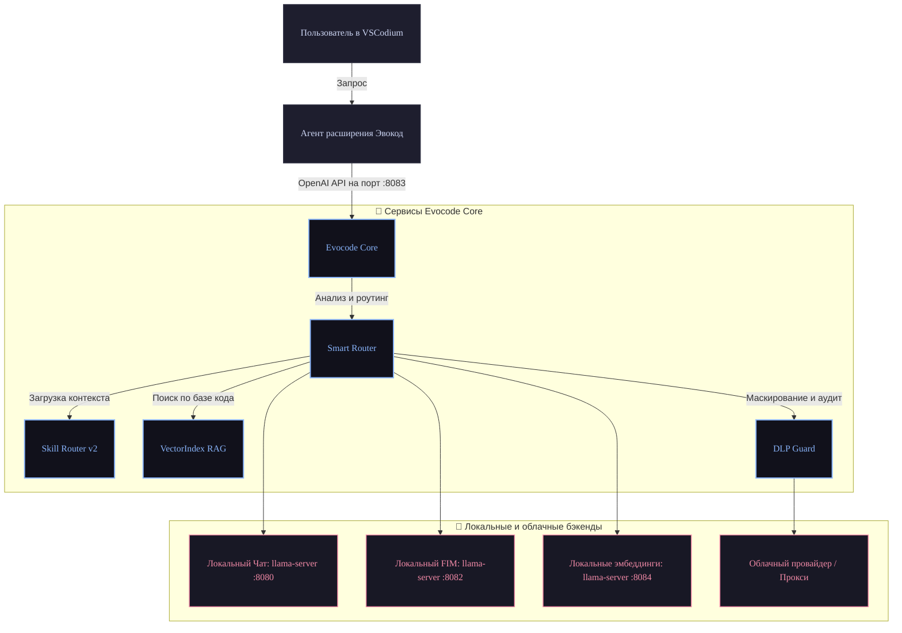

<div align="center">

# Эвокод

<br/>

**Российская privacy-first AI-IDE на базе VSCodium, локальных моделей и DLP-фильтрации**

<br/>


<br/>
<br/>

[](package.json)
[](LICENSE)
[](https://nodejs.org/)

[English Version](README_EN.md)

</div>

---

## 🚀 Статус

| Характеристика | Значение |
|----------------|----------|
| **Текущая версия** | **0.95.0** — Release Candidate 2 |
| **Текущая фаза** | F3 ✅ (Skill Router v2 + dual-model FIM) |
| **Сводка статуса** | [docs/STATUS.md](docs/STATUS.md) |
| **План разработки** | [plans/ROADMAP.md](plans/ROADMAP.md) · [plans/FULL_DEV_ROADMAP.md](plans/FULL_DEV_ROADMAP.md) |
| **Список изменений** | [CHANGELOG.md](CHANGELOG.md) |

> v0.95.0 RC2 — готовая к пилотированию AI-IDE: режим оператора, DLP и авторизация, Skill Router (M1–M4), двухмодельный локальный инференс (chat + FIM). Решение не сертифицировано; цель 1.0.0 — стабилизация по итогам пилотов.

---

## 🏗️ Архитектура

Потоки управления и запросов между интерфейсом VSCodium[^1], фоновым агентом, управляющим ядром Evocode Core и локальными/облачными провайдерами:



Заимствования и используемые сторонние компоненты приведены в [docs/ARCHITECTURE_BORROW.md](docs/ARCHITECTURE_BORROW.md) и [NOTICE](NOTICE).

---

## ⏱️ Quick start

### Требования

* Node.js версии 20 или выше
* Установленный `llama-server` и GGUF-модели вне репозитория (пути настраиваются в `config/profiles.json`)
* Для сборки агента: upstream kilo-vscode[^2] (`export KILO_SRC=...`)

### Развертывание Core + IDE (dev)

1. Клонируйте репозиторий и перейдите в его корень:
   ```bash
   git clone https://github.com/Bezooom/Evocode.git && cd Evocode
   ```
2. Подготовьте конфигурацию:
   ```bash
   cp .env.example .env
   # Настройте config/profiles.json под ваши локальные пути к моделям
   ```
3. Установите зависимости и соберите проект:
   ```bash
   npm ci && npm run build
   ```
4. Если llama-server для чата уже запущен на порту 8080:
   ```bash
   PORT=8083 EVOCODE_LLAMA_MODE=attach npm start
   ```
5. Запустите готовую сборку IDE с автоматическим стартом Core:
   ```bash
   npm run evocode
   ```

Для установки ярлыка запуска «Эвокод» в Ubuntu выполните:
```bash
npm run ide:install-desktop
npm run evocode
```

По умолчанию профиль настроек IDE сохраняется в директорию `~/.evocode-ide`. 
Для переключения моделей используйте сочетание **Ctrl+Shift+M**, для открытия чата — **Ctrl+L**. Управление агентом, навыками и MCP доступно через боковую панель настроек. Подробности см. в [PRODUCT_SHELL.md](docs/PRODUCT_SHELL.md) и [RUNTIME.md](docs/RUNTIME.md).

---

## 🔌 Порты

Сервисы и используемые ими сетевые порты по умолчанию:

| Порт | Сервис | Описание |
|------|--------|----------|
| 8080 | llama chat | Сервер локальной чат-модели (GPU, ~35B) |
| 8082 | FIM / autocomplete | Автодополнение кода на базе легкой модели (CPU, Neurocontrol) |
| **8083** | **Evocode Core** | Точка входа для агента, DLP-фильтрации и роутинга |
| 8084 | embeddings | Локальный сервер эмбеддингов |

Шаблоны профилей и путей к файлам описаны в [`config/profiles.json`](config/profiles.json) (пример в [`config/profiles.example.json`](config/profiles.example.json)). Пути поддерживают переменные окружения и сокращения `$HOME`, `${ENV}`, `~`.

---

## 📦 Дистрибутивы

Для упаковки дистрибутивов используются следующие команды:

```bash
npm run ide:package-portable    # Сборка портативной версии
npm run ide:package-deb         # Сборка deb-пакета (packages/ide/dist/evocode_0.95.0_amd64.deb)
npm run ide:package-appimage    # Сборка AppImage (Evocode-0.95.0-x86_64.AppImage)
```

---

## 📚 Документация

| Раздел | Ссылка | Описание |
|--------|--------|----------|
| **Карта разработки** | [FULL_DEV_ROADMAP](plans/FULL_DEV_ROADMAP.md) | Полная и актуальная карта задач (source of truth) |
| Статус проекта | [STATUS](docs/STATUS.md) | Текущий технический срез проекта |
| Дорожная карта | [ROADMAP](plans/ROADMAP.md) | Этапы реализации фаз F0–F4 |
| Стратегия форка | [FORK_STRATEGY](plans/FORK_STRATEGY.md) | Интеграция IDE, расширения и Core |
| Архитектура ядра | [ARCHITECTURE](docs/ARCHITECTURE.md) | Описание внутренних модулей Core |
| Тестирование | [SMOKE](docs/SMOKE.md) | Сценарии проведения E2E-тестов |
| Спецификация API | [OPENAPI](specs/OPENAPI.md) | Описание REST API Core |
| Безопасность | [SECURITY](SECURITY.md) | Политика безопасности и DLP |
| Инструкции | [CONTRIBUTING](CONTRIBUTING.md) | Руководство по сборке и отправке PR |
| Лицензии навыков | [skills/NOTICE](skills/NOTICE.md) | Происхождение и условия использования skills |

---

## 🛠️ Скрипты npm

Наиболее важные команды автоматизации в корне проекта:

```bash
npm test / npm run type-check       # Запуск тестов и проверка типов TypeScript
npm run evocode                     # Запуск IDE с автоматическим стартом Core
npm run agent:f1                    # Пересборка агента (ребрендинг + инсталляция провайдера)
npm run ide:refresh-brand           # Сброс кэша и обновление брендинга (иконки, ярлыки, профили)
npm run ide:package-portable        # Сборка переносимой версии Codium
npm run local:stack                 # Запуск локального стека моделей (llama.cpp)
```

---

## 🧬 Модули ядра

| Модуль | Назначение |
|--------|------------|
| **InferenceEngine** | Взаимодействие с API llama.cpp и внешними провайдерами |
| **Smart Router** | Динамический роутинг запросов локально/облако на основе объема контекста и приватности |
| **DLP Guard** | Сканирование и маскирование секретов/ключей в отправляемых облачных провайдерам промптах |
| **SkillLoader** | Менеджер агентных навыков (поддержка формата `.md` с гибридными эмбеддингами) |
| **VectorIndex** | Локальная база векторов на основе расширения SQLite-vec[^3] для RAG |
| **Runtime API** | Управление запущенными инстансами и профилями локальных моделей |

---

## 🗺️ Дорожная карта

Этапы разработки и готовность фаз:

| Фаза | Версия-ориентир | Описание | Статус |
|------|-----------------|----------|--------|
| **F0 Core** | 0.1 | Базовое ядро, API и локальный инференс | ✅ |
| **F1 Agent** | 0.1–0.2 | Ребрендинг и интеграция Kilo Agent | ✅ |
| **F1.5 Smoke** | 0.2–0.3 | Базовое тестирование и интеграция DLP | ✅ |
| **F2 Product** | 0.5.0 | Полноценный интерфейс и интеграция с VSCodium | ✅ |
| **F3 Hardening** | 0.9.0 RC1 | Усиление безопасности, изоляция и профили | ✅ |
| **Skill Router** | 0.95.0 RC2 | Skill Router v2 и дуал-режим FIM | ✅ **текущий** |
| **Product DoD** | 1.0.0 | Полноценный релиз по итогам пилотов | 📋 в работе |
| **F4 Self-evolve** | post-1.0 | Добавление самообучающихся агентов | 📋 запланировано |

---

## ⚖️ Лицензия

Исходный код распространяется под лицензией [MIT](LICENSE). Лицензии сторонних заимствований и навыков приведены в [NOTICE](NOTICE). При распространении и пересборке проекта сохраняйте указания авторства upstream-компонентов VSCodium, Kilo Code и OpenCode.

---

[^1]: VSCodium: Free/Libre Open Source Software Binaries of VSCode. https://github.com/VSCodium/vscodium
[^2]: Kilo Code: An open-source AI agent for coding. https://github.com/Kilo-Org/kilocode
[^3]: sqlite-vec: A vector search SQLite extension. https://github.com/asg017/sqlite-vec