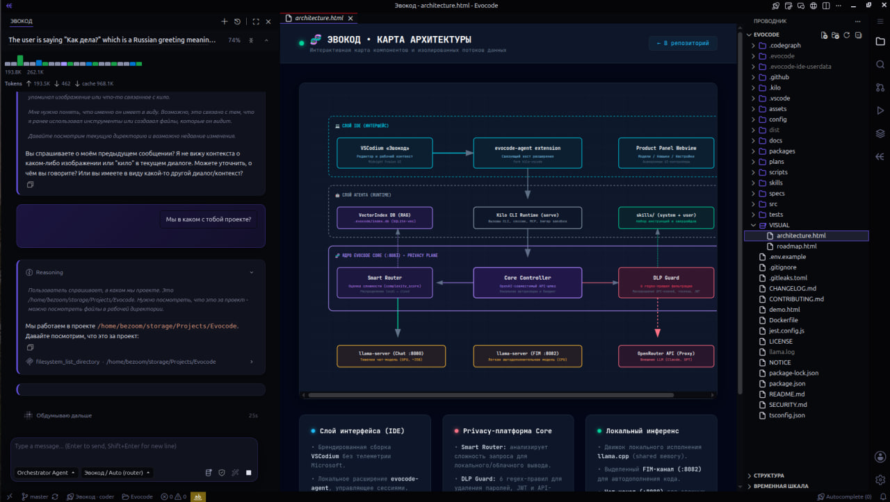
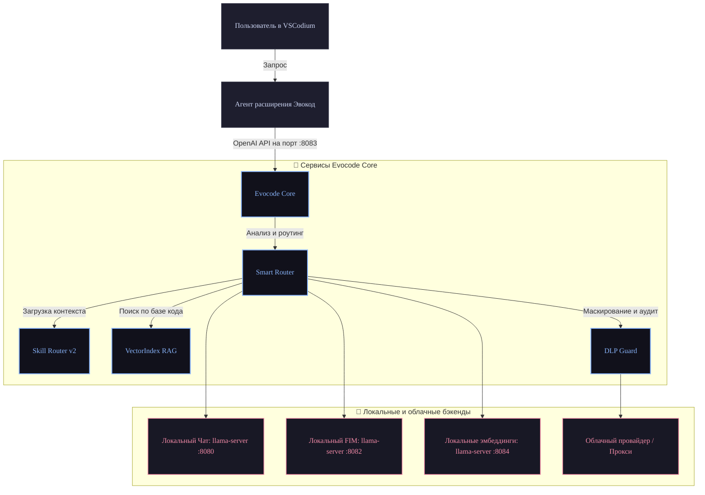

<div align="center">


<br/>
<h1>Эвокод</h1>

**Российская privacy-first AI-IDE на базе VSCodium, локальных моделей и DLP-фильтрации**

<br/>



<br/>
<br/>

[](package.json)
[](LICENSE)
[](https://nodejs.org/)

[English Version](README_EN.md)

</div>

---

## 🚀 Статус

| Характеристика | Значение |
|----------------|----------|
| **Текущая версия** | **1.0.1** — Maintenance (hardware stack + full OS releases) |
| **Текущая фаза** | **1.0.x** Production Ready |
| **Сводка статуса** | [docs/STATUS.md](docs/STATUS.md) |
| **План разработки** | [plans/ROADMAP.md](plans/ROADMAP.md) · [plans/FULL_DEV_ROADMAP.md](plans/FULL_DEV_ROADMAP.md) |
| **Список изменений** | [CHANGELOG.md](CHANGELOG.md) |

> v1.0.1 — полный multi-OS продукт (IDE + agent + Core), зонд железа и рекомендация/скачивание стека моделей; поверх 1.0.0 (оператор, Memory Bank, DLP, dual-model FIM, skill crawler).

---

## 🏗️ Архитектура

Потоки управления и запросов между интерфейсом VSCodium[^1], фоновым агентом, управляющим ядром Evocode Core и локальными/облачными провайдерами:



Заимствования и используемые сторонние компоненты приведены в [docs/ARCHITECTURE_BORROW.md](docs/ARCHITECTURE_BORROW.md) и [NOTICE](NOTICE).

---

## ⏱️ Quick start

### Требования

* Node.js версии 20 или выше
* Установленный `llama-server` и GGUF-модели вне репозитория (пути настраиваются в `config/profiles.json`)
* Для сборки агента: upstream kilo-vscode[^2] (`export KILO_SRC=...`)

### Развертывание Core + IDE (dev)

1. Клонируйте репозиторий и перейдите в его корень:
   ```bash
   git clone https://github.com/Bezooom/Evocode.git && cd Evocode
   ```
2. Подготовьте конфигурацию:
   ```bash
   cp .env.example .env
   # Настройте config/profiles.json под ваши локальные пути к моделям
   ```
3. Установите зависимости и соберите проект:
   ```bash
   npm ci && npm run build
   ```
4. Если llama-server для чата уже запущен на порту 8080:
   ```bash
   PORT=8083 EVOCODE_LLAMA_MODE=attach npm start
   ```
5. Запустите готовую сборку IDE с автоматическим стартом Core:
   ```bash
   npm run evocode
   ```

Для установки ярлыка запуска «Эвокод» в Ubuntu выполните:
```bash
npm run ide:install-desktop
npm run evocode
```

По умолчанию профиль настроек IDE сохраняется в директорию `~/.evocode-ide`. 
Для переключения моделей используйте сочетание **Ctrl+Shift+M**, для открытия чата — **Ctrl+L**. Управление агентом, навыками, **железом** и MCP — через панель настроек программы. Подробности: [PRODUCT_SHELL.md](docs/PRODUCT_SHELL.md), [RUNTIME.md](docs/RUNTIME.md), [HARDWARE_PROFILES.md](plans/HARDWARE_PROFILES.md).

### Железо и модели (first-run)

```bash
# Зонд CPU/RAM/GPU + рекомендуемый dual-model стек
curl -s localhost:8083/v1/hardware | jq '.tier,.stack'

# Записать defaults в config/profiles.local.json
curl -s -X POST localhost:8083/v1/hardware/apply -H 'content-type: application/json' -d '{}'

# Скачать недостающий GGUF (только по явному согласию)
curl -s -X POST localhost:8083/v1/models/download -H 'content-type: application/json' \
  -d '{"id":"qwen25-coder-1.5b-q4"}'
```

В UI: **Настройки Эвокод → Железо**.

---

## 🔌 Порты

Сервисы и используемые ими сетевые порты по умолчанию:

| Порт | Сервис | Описание |
|------|--------|----------|
| 8080 | llama chat | Сервер локальной чат-модели (GPU, ~35B) |
| 8082 | FIM / autocomplete | Автодополнение кода на базе легкой модели (CPU, Neurocontrol) |
| **8083** | **Evocode Core** | Точка входа для агента, DLP-фильтрации и роутинга |
| 8084 | embeddings | Локальный сервер эмбеддингов |

Шаблоны профилей и путей к файлам описаны в [`config/profiles.json`](config/profiles.json) (пример в [`config/profiles.example.json`](config/profiles.example.json)). Пути поддерживают переменные окружения и сокращения `$HOME`, `${ENV}`, `~`.

---

## 📦 Дистрибутивы

Релизы — **полный продукт** (branded IDE + built-in agent/shell + Core), не plain VSCodium. Подробно: [docs/PACKAGING.md](docs/PACKAGING.md).

```bash
npm run ide:package-portable    # Linux portable → packages/ide/dist/evocode-ide
npm run ide:package-all         # Linux/Windows/macOS → packages/ide/dist/releases/
npm run ide:package-deb         # .deb (из portable)
npm run ide:package-appimage    # AppImage (из portable)
FORCE=1 npm run ide:package-all # принудительная пересборка
```

| Архив | Пример |
|-------|--------|
| Linux x64 | `evocode-linux-x64-1.0.1.tar.gz` |
| Windows x64 | `evocode-win32-x64-1.0.1.zip` |
| macOS x64 / arm64 | `evocode-darwin-*-1.0.1.zip` |
| deb / AppImage | `evocode_1.0.1_amd64.deb`, `Evocode-1.0.1-x86_64.AppImage` |

---

## 📚 Документация

| Раздел | Ссылка | Описание |
|--------|--------|----------|
| **Карта разработки** | [FULL_DEV_ROADMAP](plans/FULL_DEV_ROADMAP.md) | Полная и актуальная карта задач (source of truth) |
| Статус проекта | [STATUS](docs/STATUS.md) | Текущий технический срез проекта |
| Упаковка / релизы | [PACKAGING](docs/PACKAGING.md) | portable, multi-OS, deb, AppImage |
| Железо и модели | [HARDWARE_PROFILES](plans/HARDWARE_PROFILES.md) | зонд, стек, скачивание GGUF |
| Дорожная карта | [ROADMAP](plans/ROADMAP.md) | Этапы реализации фаз F0–F4 |
| Стратегия форка | [FORK_STRATEGY](plans/FORK_STRATEGY.md) | Интеграция IDE, расширения и Core |
| Архитектура ядра | [ARCHITECTURE](docs/ARCHITECTURE.md) | Описание внутренних модулей Core |
| Runtime | [RUNTIME](docs/RUNTIME.md) | llama profiles, dual-model, hardware API |
| Тестирование | [SMOKE](docs/SMOKE.md) | Сценарии проведения E2E-тестов |
| Спецификация API | [OPENAPI](specs/OPENAPI.md) | Описание REST API Core |
| Безопасность | [SECURITY](SECURITY.md) | Политика безопасности и DLP |
| Инструкции | [CONTRIBUTING](CONTRIBUTING.md) | Руководство по сборке и отправке PR |
| Лицензии навыков | [skills/NOTICE](skills/NOTICE.md) | Происхождение и условия использования skills |

---

## 🛠️ Скрипты npm

Наиболее важные команды автоматизации в корне проекта:

```bash
npm test / npm run type-check       # Запуск тестов и проверка типов TypeScript
npm run evocode                     # Запуск IDE с автоматическим стартом Core
npm run agent:f1                    # Пересборка агента (ребрендинг + инсталляция провайдера)
npm run ide:refresh-brand           # Сброс кэша и обновление брендинга (иконки, ярлыки, профили)
npm run ide:package-portable        # Полный Linux portable (agent+shell+Core)
npm run ide:package-all             # Multi-OS релизы в dist/releases/
npm run ide:productize:check        # Проверка, что tree — полный продукт
npm run local:stack                 # Запуск локального стека моделей (llama.cpp)
```

---

## 🧬 Модули ядра

| Модуль | Назначение |
|--------|------------|
| **InferenceEngine** | Взаимодействие с API llama.cpp и внешними провайдерами |
| **Smart Router** | Динамический роутинг запросов локально/облако на основе объема контекста и приватности |
| **DLP Guard** | Сканирование и маскирование секретов/ключей в отправляемых облачных провайдерам промптах |
| **Hardware / Model catalog** | Зонд железа, рекомендация dual-model стека, optional download GGUF (`/v1/hardware`, `/v1/models/*`) |
| **SkillLoader & GitCrawler** | Менеджер навыков: автоматическое сканирование Git-репозиториев и конвертация правил Cursor (`.cursorrules`, `.mdc`) в `SKILL.md` |
| **External Memory Bank** | Внешняя независимая память агента (`.evocode/memory/`), сохраняющая контекст при смене LLM моделей |
| **In-Context Self-Adapter** | Динамический адаптивный слой самообучения маленькой модели (`DatasetCollector` + DLP маскирование) |
| **VectorIndex** | Локальная база векторов на основе расширения SQLite-vec[^3] для RAG |
| **Runtime API** | Управление запущенными инстансами и профилями локальных моделей (`/v1/memory`, `/v1/learning/dataset`, `/v1/skills/crawl`) |

---

## 🛠️ Система Навыков (Skill Router v2 & Git Crawler)

Эвокод включает мощную экосистему навыков (Skills Engine), превращающую базовую LLM в узкоспециализированного эксперта по предметным областям:

1. **860+ Встроенных Навыков**: В репозитории из коробки доступны профессиональные навыки по Frontend (React, Vue, Angular), Backend, Firebase, Android, Data Science, хемоинформатике/биологии, SEO, a11y, геймдеву и безопасности.
2. **Skill Router v2 (Гибридный семантический поиск)**: Автоматически подбирает релевантные навыки под контекст запроса на русском и английском языках, используя комбинацию лексических триггеров и векторных эмбеддингов (`SQLite-vec`).
3. **Автокраулер Git & Конвертер Cursor Rules**: Сканирует популярные GitHub-репозитории (`awesome-agent-skills`, `awesome-cursorrules` и др.) и на лету преобразует файлы `.cursorrules` / `.mdc` в стандартизированные файлы `SKILL.md` с валидацией безопасности и SHA-256.
4. **Пользовательские оверрайды (`skills/user/`)**: Любой созданный вами навык в директории `skills/user/` имеет высший приоритет и перекрывает системный навык с тем же именем без риска перезаписи при обновлениях.
5. **Безопасность и изоляция**: Подозрительные и лабораторные навыки изолируются меткой `tier: lab` и отключаются по умолчанию, а мега-файлы автоматически сокращаются до аннотаций (`summary_only`).

---

## 🗺️ Дорожная карта

Этапы разработки и готовность фаз:

| Фаза | Версия-ориентир | Описание | Статус |
|------|-----------------|----------|--------|
| **F0 Core** | 0.1 | Базовое ядро, API и локальный инференс | ✅ |
| **F1 Agent** | 0.1–0.2 | Ребрендинг и интеграция Kilo Agent | ✅ |
| **F1.5 Smoke** | 0.2–0.3 | Базовое тестирование и интеграция DLP | ✅ |
| **F2 Product** | 0.5.0 | Полноценный интерфейс и интеграция с VSCodium | ✅ |
| **F3 Hardening** | 0.9.0 RC1 | Усиление безопасности, изоляция и профили | ✅ |
| **Skill Router** | 0.95.0 RC2 | Skill Router v2 и дуал-режим FIM | ✅ |
| **Product DoD** | 1.0.0 | Production release | ✅ |
| **Maintenance** | **1.0.1** | Hardware stack + full multi-OS packages | ✅ **текущий** |
| **F4 Self-evolve** | post-1.0 | Добавление самообучающихся агентов | 📋 запланировано |

---

## ⚖️ Лицензия

Исходный код распространяется под лицензией [MIT](LICENSE). Лицензии сторонних заимствований и навыков приведены в [NOTICE](NOTICE). При распространении и пересборке проекта сохраняйте указания авторства upstream-компонентов VSCodium, Kilo Code и OpenCode.

---

[^1]: VSCodium: Free/Libre Open Source Software Binaries of VSCode. https://github.com/VSCodium/vscodium
[^2]: Kilo Code: An open-source AI agent for coding. https://github.com/Kilo-Org/kilocode
[^3]: sqlite-vec: A vector search SQLite extension. https://github.com/asg017/sqlite-vec