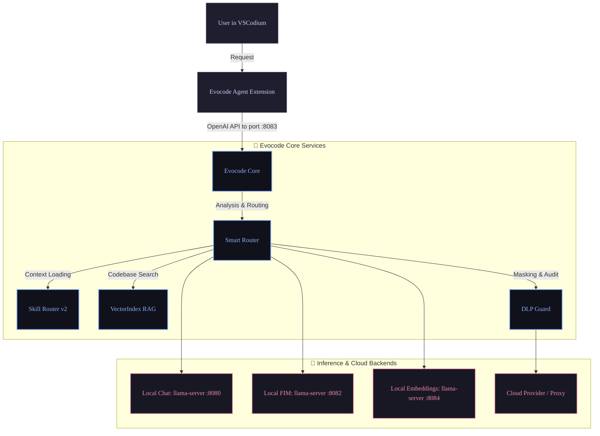

<div align="center">


<br/>
<h1>Evocode</h1>

**Russian privacy-first AI-IDE powered by VSCodium, local LLMs, and DLP filtering**

<br/>


<br/>
<br/>

[](package.json)
[](LICENSE)
[](https://nodejs.org/)

[Русская версия](README.md)

</div>

---

## 🚀 Status

| Attribute | Value |
|-----------|-------|
| **Current Version** | **1.0.1** — Maintenance (hardware stack + full OS releases) |
| **Current Phase** | **1.0.x** Production Ready |
| **Status Summary** | [docs/STATUS.md](docs/STATUS.md) |
| **Development Roadmap** | [plans/ROADMAP.md](plans/ROADMAP.md) · [plans/FULL_DEV_ROADMAP.md](plans/FULL_DEV_ROADMAP.md) |
| **Changelog** | [CHANGELOG.md](CHANGELOG.md) |

> v1.0.1 — full multi-OS product packages (IDE + agent + Core), hardware probe and model-stack recommend/download; builds on 1.0.0 (operator mode, Memory Bank, DLP, dual-model FIM, skill crawler).

---

## 🏗️ Architecture

Control and request flows between the VSCodium interface[^1], background agent, managing Evocode Core, and local/cloud providers:



Attributions and third-party components are listed in [docs/ARCHITECTURE_BORROW.md](docs/ARCHITECTURE_BORROW.md) and [NOTICE](NOTICE).

---

## ⏱️ Quick start

### Requirements

* Node.js version 20 or higher
* Installed `llama-server` and GGUF models located outside the repository (paths are configured in `config/profiles.json`)
* For building the agent: upstream kilo-vscode[^2] (`export KILO_SRC=...`)

### Deployment of Core + IDE (dev)

1. Clone the repository and navigate to its root:
   ```bash
   git clone https://github.com/Bezooom/Evocode.git && cd Evocode
   ```
2. Prepare the environment configuration:
   ```bash
   cp .env.example .env
   # Configure config/profiles.json with your local paths to GGUF models
   ```
3. Install dependencies and build the project:
   ```bash
   npm ci && npm run build
   ```
4. If llama-server for chat is already running on port 8080:
   ```bash
   PORT=8083 EVOCODE_LLAMA_MODE=attach npm start
   ```
5. Launch the IDE with automatic Core startup:
   ```bash
   npm run evocode
   ```

To install the "Evocode" launch shortcut in Ubuntu, execute:
```bash
npm run ide:install-desktop
npm run evocode
```

By default, the IDE profile is saved to the `~/.evocode-ide` directory.
Press **Ctrl+Shift+M** to switch model profiles, and **Ctrl+L** to open the chat. Management of the agent, skills, and MCP is available in the settings sidebar. For details, see [PRODUCT_SHELL.md](docs/PRODUCT_SHELL.md) and [RUNTIME.md](docs/RUNTIME.md).

---

## 🔌 Ports

Default ports used by the system:

| Port | Service | Description |
|------|---------|-------------|
| 8080 | llama chat | Local chat model server (GPU, ~35B) |
| 8082 | FIM / autocomplete | Code autocomplete server based on light model (CPU, Neurocontrol) |
| **8083** | **Evocode Core** | Entry point for agent, DLP filtering, and routing |
| 8084 | embeddings | Local embedding model server |

Profiles and file path templates are described in [`config/profiles.json`](config/profiles.json) (example in [`config/profiles.example.json`](config/profiles.example.json)). Paths support environment variables and shorthand expansions like `$HOME`, `${ENV}`, `~`.

---

## 📦 Distributions

Releases are a **full product** (branded IDE + built-in agent/shell + Core), not plain VSCodium. See [docs/PACKAGING.md](docs/PACKAGING.md).

```bash
npm run ide:package-portable    # Linux portable → packages/ide/dist/evocode-ide
npm run ide:package-all         # Linux/Windows/macOS → packages/ide/dist/releases/
npm run ide:package-deb         # .deb (from portable)
npm run ide:package-appimage    # AppImage (from portable)
FORCE=1 npm run ide:package-all # force rebuild
```

| Artifact | Example |
|----------|---------|
| Linux x64 | `evocode-linux-x64-1.0.1.tar.gz` |
| Windows x64 | `evocode-win32-x64-1.0.1.zip` |
| macOS | `evocode-darwin-*-1.0.1.zip` |

Hardware / model stack: `GET /v1/hardware`, UI tab **Hardware**, [HARDWARE_PROFILES.md](plans/HARDWARE_PROFILES.md).

---

## 📚 Documentation

| Section | Link | Description |
|---------|------|-------------|
| **Dev Map** | [FULL_DEV_ROADMAP](plans/FULL_DEV_ROADMAP.md) | Comprehensive development task map (source of truth) |
| Project Status | [STATUS](docs/STATUS.md) | Current technical status of the project |
| Packaging | [PACKAGING](docs/PACKAGING.md) | portable, multi-OS, deb, AppImage |
| Hardware | [HARDWARE_PROFILES](plans/HARDWARE_PROFILES.md) | probe, stack, GGUF download |
| Roadmap | [ROADMAP](plans/ROADMAP.md) | Realization stages for phases F0–F4 |
| Fork Strategy | [FORK_STRATEGY](plans/FORK_STRATEGY.md) | Core, agent, and IDE integration details |
| Core Architecture | [ARCHITECTURE](docs/ARCHITECTURE.md) | Inside Core modules description |
| Runtime | [RUNTIME](docs/RUNTIME.md) | llama profiles, dual-model, hardware API |
| Testing | [SMOKE](docs/SMOKE.md) | E2E smoke tests checklist |
| API Spec | [OPENAPI](specs/OPENAPI.md) | Core REST API description |
| Security | [SECURITY](SECURITY.md) | Security policy and DLP details |
| Guidelines | [CONTRIBUTING](CONTRIBUTING.md) | Contribution guide & PR requirements |
| Skills Notices | [skills/NOTICE](skills/NOTICE.md) | Origin and license of skills |

---

## 🛠️ npm Scripts

Key automation commands available in the project root:

```bash
npm test / npm run type-check       # Run tests and TypeScript type checks
npm run evocode                     # Start IDE and automatically spawn Core
npm run agent:f1                    # Rebuild agent (rebranding + provider installation)
npm run ide:refresh-brand           # Reset cache and refresh brand icons/profiles
npm run ide:package-portable        # Full Linux portable (agent+shell+Core)
npm run ide:package-all             # Multi-OS archives under dist/releases/
npm run ide:productize:check        # Verify tree is a full product
npm run local:stack                 # Start local model stack (llama.cpp)
```

---

## 🧬 Core Modules

| Module | Purpose |
|--------|---------|
| **InferenceEngine** | Communication with llama-server and external cloud providers |
| **Smart Router** | Dynamic routing local/cloud based on context size and task complexity |
| **DLP Guard** | Filtering and masking secrets/keys in outgoing cloud requests |
| **Hardware / Model catalog** | Hardware probe, dual-model stack recommendation, optional GGUF download |
| **SkillLoader & GitCrawler** | Skills manager: GitHub skills crawler & Cursor rules (`.cursorrules`, `.mdc`) converter |
| **External Memory Bank** | Independent agent memory bank (`.evocode/memory/`) preserving workspace context across model switches |
| **In-Context Self-Adapter** | Dynamic prompt self-adapter for small models with DLP-sanitized dataset collection |
| **VectorIndex** | Local vector storage using SQLite-vec[^3] extension for RAG |
| **Runtime API** | Managing spawned local model instances and profiles (`/v1/memory`, `/v1/learning/dataset`, `/v1/skills/crawl`) |

---

## 🛠️ Skill System (Skill Router v2 & Git Crawler)

Evocode features a comprehensive Skills Engine that transforms generic LLMs into domain-specific experts:

1. **860+ Out-of-the-Box Skills**: Built-in skill coverage for Frontend (React, Vue, Angular), Backend, Firebase, Android, Data Science, Bioinformatics, SEO, Accessibility, Game Dev, and Security.
2. **Skill Router v2 (Hybrid Semantic Routing)**: Dynamically selects contextually relevant skills for queries in both Russian and English using lexical triggers combined with SQLite-vec embeddings.
3. **Git Crawler & Cursor Rules Converter**: Automatically scans popular GitHub repositories (`awesome-agent-skills`, `awesome-cursorrules`, etc.) and converts `.cursorrules` / `.mdc` files into native `SKILL.md` format.
4. **User Overrides (`skills/user/`)**: Custom skills placed in `skills/user/` take precedence over system skills without risk of being overwritten during updates.
5. **Isolation & Safety**: Experimental and lab skills are marked with `tier: lab` and disabled by default, while oversized files are truncated to summaries (`summary_only`).

---

## 🗺️ Roadmap

Development phases and current status:

| Phase | Target Version | Description | Status |
|-------|----------------|-------------|--------|
| **F0 Core** | 0.1 | Basic core, API, and local inference | ✅ |
| **F1 Agent** | 0.1–0.2 | Rebranding and Kilo Agent integration | ✅ |
| **F1.5 Smoke** | 0.2–0.3 | Basic testing and DLP integration | ✅ |
| **F2 Product** | 0.5.0 | User interface & VSCodium integration | ✅ |
| **F3 Hardening** | 0.9.0 RC1 | Security hardening, OS isolation, and profiles | ✅ |
| **Skill Router** | 0.95.0 RC2 | Skill Router v2 and dual-mode FIM | ✅ |
| **Product DoD** | 1.0.0 | Production release | ✅ |
| **Maintenance** | **1.0.1** | Hardware stack + full multi-OS product packages | ✅ **current** |
| **F4 Self-evolve** | post-1.0 | Self-evolving coding agents | 📋 scheduled |

---

## ⚖️ License

The source code is licensed under the [MIT](LICENSE) license. Third-party components licenses are listed in [NOTICE](NOTICE). Please retain attributions to upstream VSCodium, Kilo Code, and OpenCode projects when distributing or rebuilding.

---

[^1]: VSCodium: Free/Libre Open Source Software Binaries of VSCode. https://github.com/VSCodium/vscodium
[^2]: Kilo Code: An open-source AI agent for coding. https://github.com/Kilo-Org/kilocode
[^3]: sqlite-vec: A vector search SQLite extension. https://github.com/asg017/sqlite-vec