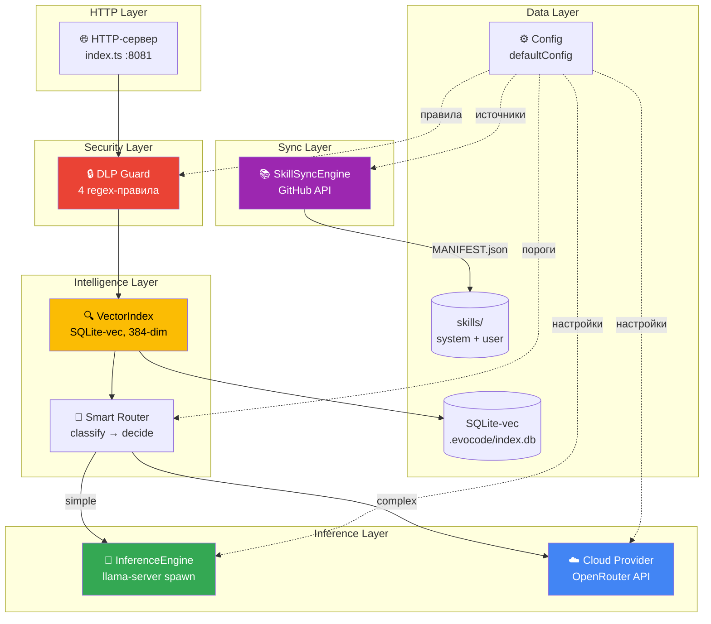
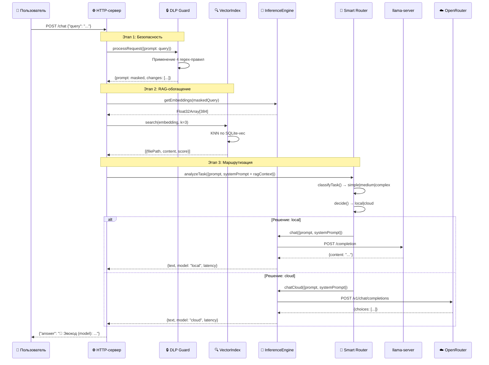
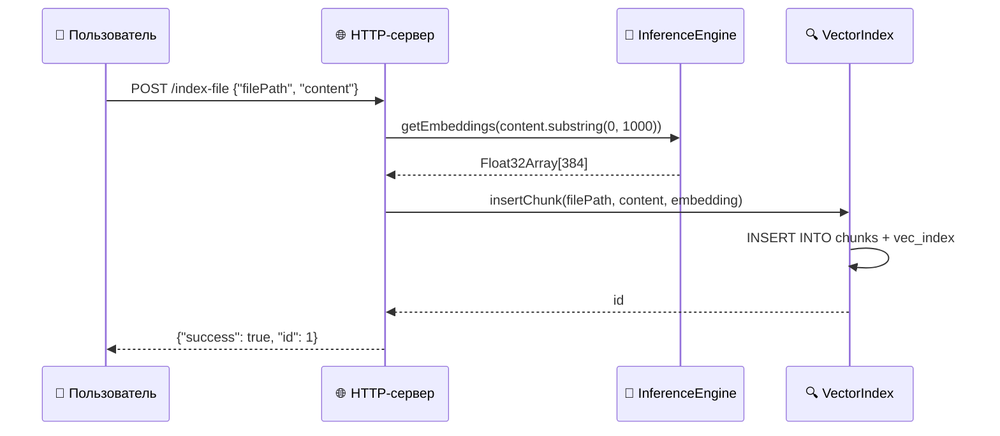
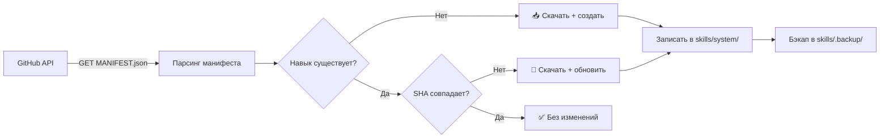
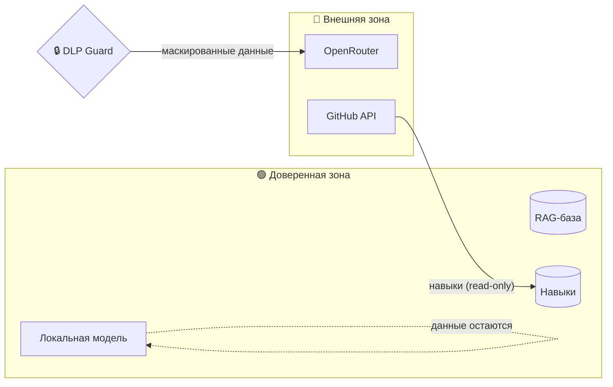
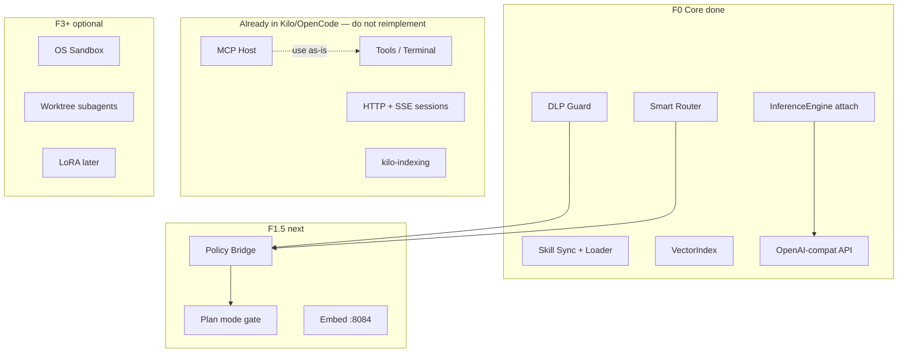

# Архитектура Эвокод

## Обзор

Эвокод — модульная серверная система с архитектурой **privacy-first**, построенная на принципах:

- **Локальность** — весь инференс по умолчанию выполняется на устройстве через llama.cpp
- **Модульность** — каждый компонент изолирован и заменяем
- **Безопасность** — данные не покидают устройство без прохождения DLP-фильтра
- **Offline-ready** — полная функциональность без интернета (кроме облачного маршрута и синхронизации)

Система реализована как standalone HTTP-сервер на Node.js/TypeScript (**порт 8083** по умолчанию; chat llama — 8080).

> **Важно (2026-07-19):** agent loop / MCP / tools **не** реализуются в Core — они живут в **Kilo/OpenCode**.  
> Core = privacy plane. См. [ARCHITECTURE_BORROW.md](./ARCHITECTURE_BORROW.md) и [FORK_STRATEGY](../plans/FORK_STRATEGY.md).

---

## Схема компонентов



---

## Поток данных

### Обработка запроса POST /chat



### Индексация файла POST /index-file



---

## Модули

### 1. InferenceEngine (`src/engine/inference.ts`, 316 строк)

Управляет локальным и облачным инференсом.

**Локальный инференс:**
- Запускает `llama-server` через `child_process.spawn` с аргументами из конфига
- Ожидает готовности через polling `/health` endpoint (до 30 сек)
- Graceful shutdown: `SIGTERM` → 5 сек → `SIGKILL`

**Методы:**
| Метод | Описание |
|-------|----------|
| `startLocalServer()` | Запуск llama-server с аргументами `--model`, `--port`, `--n-predict`, `--host` |
| `stopLocalServer()` | Остановка процесса llama-server |
| `fim(request)` | Fill-In-the-Middle — автодополнение кода |
| `chat(request)` | Чат через локальную модель (`/completion`) |
| `chatCloud(request)` | Чат через OpenRouter (`/v1/chat/completions`) |
| `getEmbeddings(text)` | Генерация 384-мерного вектора через `/embedding` |

**Конфигурация:**
```typescript
inference.local.model   = "qwen3.6-35b-q4_k_m.gguf"
inference.local.port    = 8080
inference.local.nPredict = 32768
inference.local.timeout = 900  // секунд
inference.cloud.model   = "anthropic/claude-sonnet-4.2"
```

---

### 2. DLP Guard (`src/guard/dlp-guard.ts`, 126 строк)

Data Loss Prevention — маскирует конфиденциальные данные перед отправкой в облако.

**Pipeline:**
1. Принимает текст запроса
2. Последовательно применяет 4 regex-правила
3. Возвращает маскированный текст + список изменений

**Правила:**

| # | Имя | Паттерн | Что маскирует |
|---|-----|---------|---------------|
| 1 | `api-key` | `api[_-]?key[:=]\s*["']?([a-zA-Z0-9_-]{20,})` | API-ключи (≥20 символов) |
| 2 | `token` | `token[:=]\s*["']?([a-zA-Z0-9_-]{20,})` | Токены авторизации |
| 3 | `password` | `password[:=]\s*["']?([^\s"']{8,})` | Пароли (≥8 символов) |
| 4 | `secret` | `secret[:=]\s*["']?([^\s"']{10,})` | Секреты (≥10 символов) |

**Интерфейс:**
```typescript
interface MaskResult {
  original: string;
  masked: string;
  changes: { rule: string; position: number; }[];
  wasMasked: boolean;
}
```

---

### 3. Smart Router (`src/router/smart-router.ts`, 127 строк)

Классифицирует задачи и принимает решение о маршрутизации.

**Алгоритм:**
1. `classifyTask(prompt)` → анализ ключевых слов → `simple | medium | complex`
2. `decide(context)` → на основе сложности, размера контекста, наличия вложений → `local | cloud`
3. `processRequest(request, context)` → вызов InferenceEngine

**Ключевые слова классификации:**

| Категория | Ключевые слова (рус) | Ключевые слова (eng) |
|-----------|---------------------|---------------------|
| **simple** | исправь, обнови, переименуй, удали, убери, форматируй | fix, update, rename, delete, remove, format |
| **complex** | спроектируй, архитектура, рефакторинг, миграция, ревью | refactor, migrate, design, review, debug, test |

**Правила маршрутизации:**
- `simple` + малый контекст → **local**
- `complex` + большой контекст → **cloud**
- Наличие вложений → **cloud**
- Генерация кода → **local** (privacy)

---

### 4. Skill Sync Engine (`src/sync/skill-sync.ts`, 320 строк)

Автоматическая синхронизация навыков из GitHub-репозиториев.

**Процесс синхронизации:**


**Методы:**
| Метод | Описание |
|-------|----------|
| `sync()` | Полная синхронизация всех источников → `SyncResult` |
| `checkSource(source)` | Проверка одного источника (GitHub repo) |
| `loadExistingSkills()` | Загрузка текущих навыков с диска |
| `getLog()` | История синхронизаций |

**Транспорт:** `https.get()` → обработка 3xx редиректов → JSON/text парсинг

---

### 5. VectorIndex (`src/indexer/vector-index.ts`, 96 строк)

RAG-индекс на основе SQLite с расширением `sqlite-vec`.

**Параметры:**
- Размерность эмбеддингов: **384**
- Алгоритм поиска: **KNN** (K-Nearest Neighbors)
- Хранилище: `.evocode/index.db`

**SQL-схема:**
```sql
CREATE TABLE chunks (
  id INTEGER PRIMARY KEY AUTOINCREMENT,
  filePath TEXT NOT NULL,
  content TEXT NOT NULL,
  embedding BLOB NOT NULL
);

CREATE VIRTUAL TABLE vec_index USING vec0 (
  chunk_id INTEGER REFERENCES chunks(id),
  embedding float[384]
);
```

**Методы:**
| Метод | Описание |
|-------|----------|
| `insertChunk(filePath, content, embedding)` | Добавление чанка в индекс |
| `search(queryEmbedding, k)` | KNN-поиск k ближайших чанков |
| `deleteByFile(filePath)` | Удаление всех чанков файла |

---

### 6. Config (`src/core/config.ts`, 167 строк)

Централизованная конфигурация с типизированными интерфейсами.

**Структура:**
```typescript
EvocodeConfig {
  appName, appVersion, language,
  inference: { local: {...}, cloud: {...} },
  skills: { systemPath, userPath, backupPath, archivePath },
  sync: { enabled, interval, sources: SyncSource[] },
  dlp: { enabled, rules: DLPRule[] },
  router: { enabled, localThreshold, cloudThreshold }
}
```

**Загрузка:** `loadConfig(path)` — JSON-файл → merge с `defaultConfig`

---

## Зависимости

| Пакет | Версия | Назначение |
|-------|--------|------------|
| `typescript` | ^5.0 | Язык разработки |
| `better-sqlite3` | ^11.0 | SQLite для VectorIndex |
| `sqlite-vec` | ^0.1 | Расширение для векторного поиска |
| `jest` | ^29.0 | Unit-тестирование |
| `ts-jest` | ^29.0 | TypeScript поддержка для Jest |

---

## Безопасность

### Модель угроз



**Гарантии:**
1. Локальные запросы **никогда** не отправляются в сеть
2. Облачные запросы проходят через DLP Guard — секреты маскируются
3. Skill Sync — read-only, не отправляет пользовательские данные
4. RAG-база хранится локально в `.evocode/index.db`
5. API-ключ облачного провайдера хранится в переменной окружения

---

## Планируемые модули (актуально)



### Приоритет (не плодить agent)

| Модуль | Источник идеи | Где живёт |
|--------|---------------|-----------|
| OpenAI-compat API | openai_proxy / OpenCode | **Core — done** |
| MCP / tools / agent loop | OpenCode/Kilo | **Kilo — as-is** |
| Policy bridge + DLP modes | Grok permissions | Core + kilo config — F1.5 |
| Plan mode write-gate | Grok plan mode | kilo modes + policy — F1.5/F2 |
| Streaming | kilo SSE | primary; Core chunked secondary |
| Smart Router v2 ML | Router/ | optional after F1.5 |
| OS sandbox | Grok Landlock | F3 |
| Worktree subagents | Grok + Kilo AM | F3 |
| LoRA / self-improve | Neurocontrol / Archon | F4 after usable IDE |

Подробности: [ARCHITECTURE_BORROW.md](./ARCHITECTURE_BORROW.md), [ROADMAP.md](../plans/ROADMAP.md).

---

## Расширяемость

### Добавление нового модуля

1. Создайте файл в `src/<category>/<module-name>.ts`
2. Экспортируйте singleton-экземпляр
3. Импортируйте в `src/index.ts`
4. Добавьте конфигурацию в `EvocodeConfig` (если нужна)

### Формат навыков

Каждый навык — файл `SKILL.md` с YAML-frontmatter:

```yaml
---
name: my-skill
version: "1.0.0"
source: github.com/user/repo
sha: abc123def456
---

# Описание навыка

Инструкции для агента...
```

Подробнее: [examples_SKILL.md](examples_SKILL.md)

---

*Последнее обновление: 2026-07-19*
