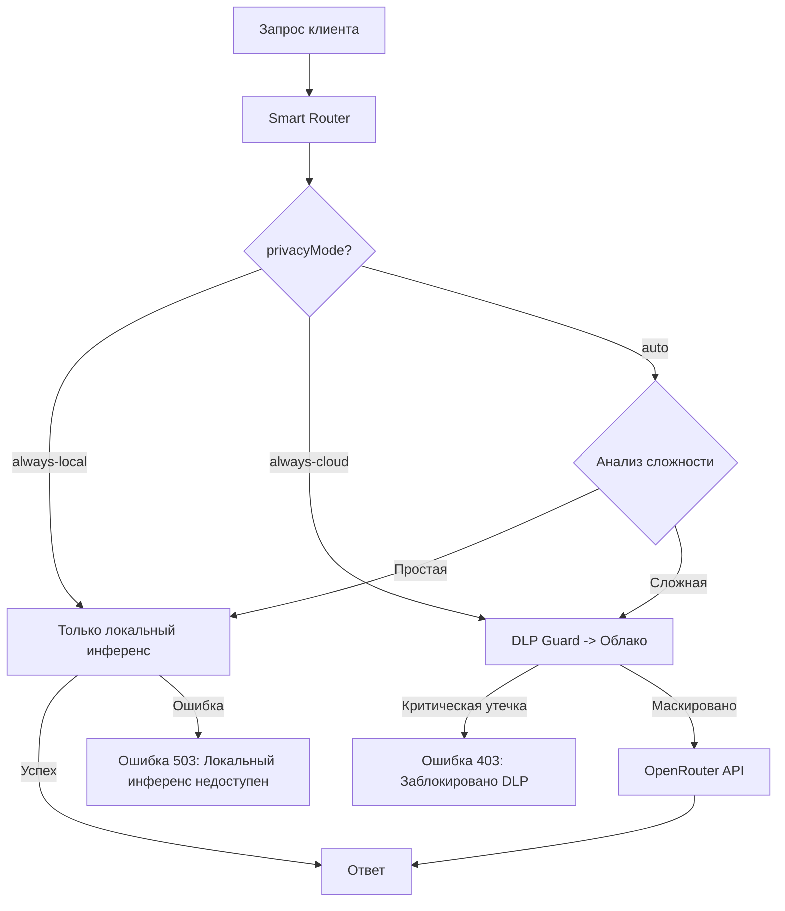

# 🛡️ Мост политик безопасности (Policy Bridge)

Этот документ описывает спецификацию **Policy Bridge** — механизма контроля конфиденциальности данных и выполнения политик безопасности при работе ИИ-ассистента Эвокод в различных сетевых окружениях.

---

## 🔒 Режимы конфиденциальности (privacyMode)

Режим конфиденциальности настраивается в конфигурационном файле (`src/core/config.ts`) или через переменную окружения `EVOCODE_MODE`. Поддерживаются три основных режима:

### 1. `always-local` (Всегда локально)
*   **Сценарий использования:** Работа в закрытом корпоративном контуре (on-premise), без доступа к внешнему интернету, либо при строгих требованиях коммерческой тайны.
*   **Правила маршрутизации:**
    *   Все запросы безусловно направляются на локальный `llama-server`.
    *   Любая попытка облачного вызова (OpenRouter) блокируется на уровне ядра с выбросом `InferenceError('CLOUD_UNAVAILABLE')`.
    *   В случае падения локального инференса автоматический fallback на облачные модели **запрещён** (возвращается ошибка HTTP 503).
    *   Любые внешние сетевые запросы от субагентов (например, веб-сёрфинг) блокируются.
    *   DLP Guard работает локально для аудита и логирования предупреждений пользователя (без отправки данных).

### 2. `auto` (Гибридный режим / По умолчанию)
*   **Сценарий использования:** Стандартная разработка на рабочей станции с доступом в сеть, балансирующая скорость, приватность и качество генерации.
*   **Правила маршрутизации:**
    *   Задачи классифицируются Smart Router v2 на основе когнитивной сложности.
    *   Простые задачи (автодополнение, мелкие правки) -> локально.
    *   Сложные задачи (проектирование архитектуры, комплексный рефакторинг) -> в облако через OpenRouter (с обязательным DLP-маскированием).
    *   **Отказоустойчивость:** Если локальный `llama-server` падает или перегружен, Core автоматически выполняет fallback-запрос в облако (через DLP), если в системе настроен облачный API-ключ.

### 3. `always-cloud` (Всегда облако)
*   **Сценарий использования:** Работа на слабых локальных машинах (без GPU) с использованием мощных удалённых моделей.
*   **Правила маршрутизации:**
    *   Все запросы безусловно направляются в облако.
    *   Все отправляемые данные в обязательном порядке проходят через **DLP Guard**.
    *   Если в промпте обнаружены критические утечки (API-ключи, пароли), запрос блокируется до отправки в сеть с кодом 403 (`DLPBlockedError`).

---

## 🔒 DLP Guard: Правила маскирования

DLP Guard применяет регулярные выражения перед отправкой запросов во внешнюю сеть:

| Название правила | Паттерн поиска | Действие |
|------------------|----------------|----------|
| `api-key` | API-ключи провайдеров (длина ≥ 20 символов) | Замена на `api_key: "****"` |
| `token` | Токены авторизации, JWT | Замена на `token: "****"` |
| `password` | Пароли в конфигурациях и строках подключения | Замена на `password: "****"` |
| `secret` | Секретные ключи шифрования | Замена на `secret: "****"` |

При включенной опции `blockOnCritical` в конфигурации DLP, обнаружение любого критического секрета (например, приватных SSL-ключей или паролей баз данных) приводит к **полной блокировке** запроса к облачной модели, вместо простого маскирования, чтобы избежать неявных утечек.

---

## 🛠️ Спецификация реализации Policy Gate в Smart Router

