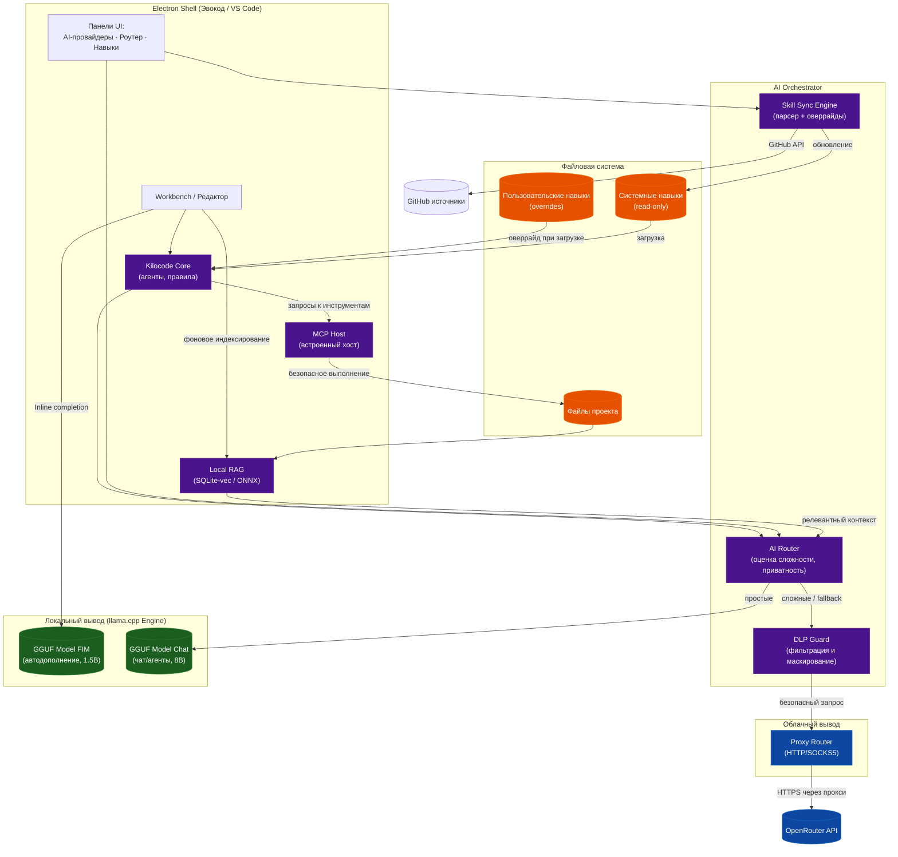

# Техническое задание
## Форк редактора VS Code «Эвокод» — российская AI-ориентированная среда разработки с локальным inference-фреймворком и самоактуализацией навыков

**Документ:** ТЗ-ЭК-001
**Версия:** 1.2
**Дата:** 2026-07-18
**Статус:** Проект

---

## 1. Общие сведения

| Позиция | Значение |
|---------|----------|
| Наименование системы | «Эвокод» (рабочее название форка VS Code) |
| База | VS Code (Electron, открытый исходный код под MIT-лицензией; форк репозитория `microsoft/vscode`) |
| Заказчик | Индивидуальный разработчик (bezoom) |
| Исполнитель | Команда разработки форка |
| Цель | Объединить настройку kilocode + VS Code в единое российское приложение с встроенным локальным inference-фреймворком (класса llama.cpp) по умолчанию, умным роутером между локальным и облачным выводом и ежедневной автоактуализацией навыков из GitHub |

Приложение «Эвокод» позиционируется как приватный, офлайн-ориентированный AI-редактор для российского разработчика. Базовая повседневная работа (автодополнение, локальный чат, небольшие правки, генерация документации) выполняется локально на встроенном inference-фреймворке, в который загружается GGUF-модель пользователя. Сложные задачи, а также случаи сбоя или недоступности локального вывода, автоматически перенаправляются в облако (OpenRouter) через настраиваемый прокси-роутер. Главная отличительная особенность системы — механизм самоактуализации: при каждом запуске и по ежедневному расписанию приложение парсит указанные репозитории GitHub, выявляет новые и изменённые навыки/инструкции/агентов и применяет их к собственной системе, поддерживая актуальность «под ключ».

---

## 2. Назначение и цели разработки

### 2.1. Назначение
Создание самодостаточной среды разработки, не зависящей от зарубежных облачных сервисов для повседневной работы, с гибридной архитектурой (локальный вывод + облачный резерв по требованию) и встроенной подсистемой агентов/навыков (kilocode), дополненной механизмом непрерывного обновления знаний из публичных источников.

### 2.2. Цели
- Работающий форк VS Code с русскоязычным интерфейсом «из коробки» и российским брендингом.
- Встроенный локальный inference-фреймворк (класса llama.cpp), скомпилированный в дистрибутив, — без необходимости устанавливать стороннее ПО; пользователь подгружает GGUF-модель.
- Умный роутер запросов между локальным фреймворком и облаком (OpenRouter) с прозрачной логикой и fallback.
- Перенос подсистемы kilocode (агенты, навыки, правила, MCP-серверы) во встроенный модуль приложения.
- Ежедневная синхронизация навыков/инструкций/агентов с GitHub при запуске и по расписанию с верификацией и возможностью отката.

---

## 3. Требования к системе

### 3.1. Функциональные требования

#### FR-01. Встроенный локальный inference-фреймворк (класса llama.cpp)
- В дистрибутив приложения вкомпилирован inference-фреймворк класса llama.cpp (native-модуль на C/C++ либо предсобранный бинарный рантайм), запускаемый в отдельном worker-процессе внутри Electron-оболочки. Сам фреймворк является движком вывода, а не конкретной моделью.
- **Поддержка двухмодельного режима (Dual-Model Local Inference):** фреймворк поддерживает одновременное или быстро-переключаемое (shared memory) обслуживание двух локальных моделей:
  1. *Модель автодополнения (FIM - Fill-in-the-Middle):* сверхлегкая модель (класса 1.5B–3B, например Qwen2.5-Coder-1.5B-GGUF) для мгновенной генерации inline-подсказок (latency < 100ms).
  2. *Интерактивная модель (Chat/Skills):* более крупная модель (класса 7B–14B, например LLaMA-3.1-8B-GGUF / Qwen2.5-Coder-7B) для сложного чата и выполнения kilocode-агентов.
- При первом запуске приложение предлагает скачать рекомендованные GGUF-модели или подхватывает уже имеющиеся в каталоге пользователя (`~/.config/evocode/models/`). Фреймворк загружает выбранные модели в память/VRAM с возможностью жесткого разграничения лимитов видеопамяти.
- Вывод локальных запросов не покидает машину пользователя: отключена телеметрия промптов локального вывода (опционально — анонимная статистика частоты использования, только с явного согласия).
- Поддержка квантованных GGUF-моделей: выбор модели, число слоёв на GPU (`n_gpu_layers`), размер контекста (`n_ctx`), температура, `top_p`, `repeat_penalty` — настраиваются в UI индивидуально для FIM и Chat инстансов.
- Возможность смены/добавления моделей без пересборки приложения (каталог моделей пользователя + импорт по URL/файлу).
- Индикация статуса фреймворка: загружены ли модели, util GPU/CPU, занятая память, скорость генерации (tok/s) по каждому инстансу.

#### FR-02. Умный роутер (AI Router)
Компонент принимает решение о маршрутизации каждого AI-запроса до его исполнения.

- **Локальный приоритет:** типовые задачи (autocomplete, мелкие правки, rename, генерация документации, локальный чат, простые вопросы) → локальный фреймворк на загруженной GGUF-модели.
- **Облачный роутинг:** сложные задачи (генерация кода большого объёма, multi-file рефакторинг, глубокий reasoning, контекст больше заданного порога, задачи, требующие свежих знаний/поиска) → OpenRouter через прокси-роутер.
- **Fallback:** при ошибке локального инференса / таймауте / недоступности модели / нехватке памяти → автоматическое переключение на OpenRouter без потери прогресса (повторный вызов с тем же промптом).
- **Оценка сложности:** эвристический скорер запроса (длина промпта, наличие тегов задач, размер затрагиваемых файлов, признаки «сложного» паттерна) выдаёт метрику `complexity_score` ∈ [0..1]; порог `local_max_score` настраивается.
- **Настраиваемость:** пользователь задаёт правила (регулярные выражения/теги задач), пороги сложности, приоритет приватности: «всегда локально» / «авто» / «всегда облако».
- **Прозрачность:** в UI у каждого ответа — бейдж источника («Локально» / «Облако») и причина выбора маршрута (для режима «авто»).

#### FR-03. Прокси-роутер OpenRouter
- Единая точка исходящего трафика к OpenRouter через настраиваемый HTTP(S)-прокси (для работы в сетях РФ и корпоративных контурах с ограниченным доступом). Поддержка SOCKS5/HTTP-прокси с аутентификацией.
- Хранение API-ключа OpenRouter в защищённом локальном хранилище (системный Keychain / `libsecret` / Keychain macOS), никогда не в открытом виде в конфигах.
- Поддержка выбора модели OpenRouter (по умолчанию из конфигурации kilo: `agy/gemini-3.5-flash-low` или аналог); возможность указать несколько моделей с приоритетом.
- Таймауты, повторные попытки (retry) и обработка ошибок API с понятными сообщениями на русском.

#### FR-04. Интеграция kilocode (Kilocode Core)
- Перенос конфигурации kilocode: агенты (`~/.config/kilo/agent/`), навыки (`~/.config/kilo/skills/`, `~/.kilo/skills/`), правила (`INSTRUCTIONS.md`, `AGENTS.md`), MCP-серверы (`filesystem`, `sequentialthinking` и др.).
- Встроенный «Kilocode Core»: парсинг навыков (формат `SKILL.md`), рендер инструкций, запуск субагентов внутри приложения, управление контекстом промптов.
- Обратная совместимость с форматами `.kilo` / `.claude` skill-файлов (импорт без переписывания).
- Единый каталог навыков приложения: `~/.config/evocode/skills/` (синхронизируется механизмом FR-05).

#### FR-05. Самоактуализация навыков (Skill Sync Engine) — ГЛАВНАЯ ФИШКА
При каждом запуске и по расписанию (по умолчанию — раз в сутки, 03:00 локального времени) система синхронизирует навыки с внешними источниками.

1. **Источники:** конфигурируемый список репозиториев/путей GitHub, содержащих `skills`/`instructions`/`agents` (например, официальные репозитории kilocode и форк пользователя). Хранятся в `~/.config/evocode/sync-sources.json`.
2. **Разделение каталогов (Skill Overrides):** для исключения конфликтов автообновлений с локальными изменениями пользователя файловая структура навыков делится на две зоны:
   - *Системная зона (read-only):* `~/.config/evocode/skills/system/` — обновляется Sync Engine. Изменения файлов в этой папке пользователем напрямую запрещены.
   - *Пользовательская зона (overrides):* `~/.config/evocode/skills/user/` — здесь пользователь может создавать новые навыки или размещать оверрайды (файлы с тем же `id` / `name`), которые перекрывают системные при загрузке. Данная папка полностью игнорируется Sync Engine при обновлении.
3. **Парсинг:** через GitHub API (REST `git/trees` + `commits`) получить дерево файлов и последние хеши коммитов каталогов навыков для каждого источника.
4. **Diff:** сравнить локальную версию каждого навыка в системной зоне с удалённой по content-hash; классифицировать: `new` (новый), `changed` (изменён), `removed` (удалён в источнике), `unchanged`.
5. **Применение:** автоматически подтянуть `new` и `changed` в системную зону; для `removed` — soft-delete (пометить, оставить файл в `.archive/` с возможностью восстановления, не удалять жёстко без подтверждения).
6. **Верификация:** проверка подписи/хеша источника (при наличии), базовая валидация структуры `SKILL.md` (наличие обязательных полей: `name`, `description`).
7. **Rollback:** перед применением изменений сохраняется предыдущая версия системных навыков в `~/.config/evocode/skills/.backup/<дата>/`; откат одной кнопкой для любого системного навыка или всей пачки.
8. **Лог:** журнал всех операций (что, когда, откуда, результат, размер diff) во встроенной панели «Навыки → Лог синхронизации».
9. **Офлайн-поведение:** при недоступности сети синхронизация пропускается, работает последняя сохранённая версия; в лог пишется «offline, skip».

#### FR-06. Локальный векторный контекст (RAG over Codebase)
- В приложение встроен легковесный движок локального RAG на базе компактной векторной библиотеки (например, SQLite-vec / SQLite FTS5 + векторы / Chroma-подобная embedded БД) без внешних зависимостей типа Docker.
- Фоновое индексирование: Эвокод при открытии рабочей директории в фоновом режиме строит семантический индекс файлов (эмбеддинги генерируются локально через сверхбыструю ONNX-модель в отдельном потоке, например `all-MiniLM-L6-v2` или аналогичную).
- Интеграция с роутером: при составлении запроса к LLM система находит наиболее релевантные куски кода и структуры классов текущего репозитория и подмешивает их в системный промпт (context injection) без выхода данных за пределы локальной машины.
- Настройка: включение/выключение индексации, маски файлов (исключить `.env`, `node_modules`, `dist`), глубина извлечения контекста.

#### FR-07. Защита от утечки данных (DLP Guard)
- Все исходящие облачные запросы (маршрутизируемые в OpenRouter) в обязательном порядке проходят через локальный шлюз фильтрации конфиденциальных данных (DLP Guard).
- Локальная фильтрация: регулярные выражения и быстрые эвристические лексеры проверяют тело промпта на наличие приватных ключей шифрования, паролей, JWT-токенов, API-ключей, номеров кредитных карт и путей внутренних баз данных.
- Маскирование: обнаруженные чувствительные данные автоматически маскируются (например, заменяются на `[REDACTED_API_KEY]`, `[REDACTED_PASSWORD]`) перед непосредственной отправкой по сети в API OpenRouter.
- Оповещение: при обнаружении критической утечки (например, промпт содержит полный дамп конфига с паролями) отправка блокируется, и пользователю выводится предупреждение с возможностью принудительно разрешить отправку или скорректировать промпт.

#### FR-08. Встроенный хост протокола MCP (Model Context Protocol)
- Эвокод выступает в роли нативного хоста протокола MCP. AI-ассистент (как локальный, так и облачный через прокси-клиент) взаимодействует с инструментами разработчика по стандартизированному протоколу.
- Интегрированные MCP-серверы:
  - *Filesystem:* безопасное чтение и запись файлов проекта с контролем прав.
  - *Terminal/Execution:* запуск локальных линтеров, тестов, команд сборки с выводом в консоль редактора.
  - *Sequential Thinking:* поддержка динамических цепочек рассуждений для сложных архитектурных задач.
- Управление серверами: в UI Эвокода доступен менеджер MCP-подключений, где пользователь может добавлять кастомные локальные или удаленные MCP-серверы (через JSON-конфиг) и настраивать их права доступа.

### 3.2. Нефункциональные требования

- **Производительность:** локальный инференс (через встроенный фреймворк) не блокирует UI редактора (выполняется в worker-процессе); отклик чата < 2 с до первого токена на кванте Q4 на типовом ПК (CPU 8 ядер / GPU 6 ГБ VRAM).
- **Приватность:** промпты локальных запросов не передаются третьим лицам; облачные запросы уходят только при срабатывании роутера (режим «авто»/«облако») либо по явному действию пользователя.
- **Совместимость:** поддержка существующих расширений VS Code (marketplace-совместимость или форк open-vsx); сохранение формата `settings.json`, `keybindings.json`.
- **Безопасность:** верификация обновлений из GitHub (checksum/подпись), песочница (sandbox) для исполнения навыков, ограничение доступа к ФС только разрешёнными каталогами.
- **Локализация:** интерфейс, документация и сообщения об ошибках на русском языке; возможность переключения на английский.
- **Кроссплатформенность:** сборки под Windows 10+, Linux (в т.ч. Astra Linux Special Edition), macOS 12+.
- **Надёжность:** падение локального фреймворка не обрушивает редактор (изолированный процесс, перезапуск по требованию).

---

## 4. Архитектура системы

### 4.1. Диаграмма компонентов (Mermaid)

### 4.2. Компоненты
- **Electron Shell** — форк VS Code, русская локализация, брендинг «Эвокод».
- **Inference Engine** — встроенный двухмодельный фреймворк класса llama.cpp, поддерживающий параллельный запуск FIM (автодополнение) и Chat (диалог, навыки) инстансов.
- **AI Router** — модуль принятия решений о маршрутизации с эвристическим скорером сложности.
- **DLP Guard** — локальный шлюз фильтрации исходящего трафика, маскирующий приватные ключи, пароли и секреты перед отправкой во внешние API.
- **Local RAG** — фоновый индексатор проекта на SQLite-vec/FTS5 с генерацией локальных эмбеддингов через ONNX.
- **MCP Host** — встроенный хост для безопасного выполнения MCP-инструментов (работа с файлами, выполнение команд).
- **Proxy Router** — HTTP(S)/SOCKS5-клиент к OpenRouter с поддержкой шифрованного Keychain-хранения ключей.
- **Skill Sync Engine** — планировщик синхронизации с разграничением read-only системной зоны и user-overrides.
- **Kilocode Core** — встроенная подсистема выполнения агентов и применения промптов.

### 4.3. Потоки данных
- **Локальный путь:** Ввод пользователя / Inline-completion → (RAG-контекст) → AI Router → Inference Engine (FIM_MOD / CHAT_MOD) → MCP Host (выполнение действий) → Вывод в редактор.
- **Облачный путь:** AI Router → DLP Guard (проверка, маскирование) → Proxy Router → OpenRouter API → Вывод в редактор.
- **Синхронизация:** Skill Sync Engine → GitHub API → diff-анализ → обновление `skills/system/`. Загрузка Kilocode Core слияет `skills/system/` и `skills/user/` с приоритетом оверрайдов.

---

## 5. Требования к интерфейсу

- Русскоязычный UI по умолчанию (меню, палитра команд, настройки, сообщения).
- **Панель «AI-провайдеры»:** статус локального фреймворка, кнопка загрузки/смены модели, индикатор загрузки (GPU/CPU, tok/s), выбор модели из каталога.
- **Панель «Роутер»:** правила маршрутизации, приоритет приватности, порог `local_max_score`, список последних запросов с бейджем источника и причиной выбора.
- **Панель «Навыки» (Skill Sync):** список навыков с статусом (актуально / обновлён / новый / удалён), кнопка «Обновить сейчас», кнопка «Откатить», вкладка «Лог синхронизации», настройки источников (`sync-sources.json` через UI).
- **Строка состояния:** текущий провайдер (Локально / Облако), версия набора навыков, индикатор активной синхронизации.
- Настройки роутера и синхронизации доступны через `Settings → Эвокод`.

---

## 6. Требования к безопасности и приватности

- Локальный вывод не покидает устройство; телеметрия промптов локального вывода отключена (опционально — анонимная статистика использования по согласию).
- API-ключ OpenRouter хранится в системном защищённом хранилище (`libsecret` / Keychain / Windows Credential Manager), не в текстовых конфигах и не в логах.
- Обновления навыков верифицируются по хешу/подписи источника; невалидные пакеты отбрасываются с записью в лог.
- Навыки исполняются в ограниченном окружении (sandbox); доступ к файловой системе — только в разрешённых каталогах (рабочая директория, каталог навыков).
- Логи не содержат секретов, ключей и полных тел промптов (только метаданные: длина, тег задачи, источник).
- Изоляция процесса фреймворка: падение не влияет на стабильность редактора.

---

## 7. Порядок работы (сценарии)

### 7.1. Запуск приложения
1. Старт Electron-оболочки, загрузка русской локализации и брендинга.
2. Инициализация Kilocode Core: загрузка системных навыков из `skills/system/`, затем накатывание оверрайдов из `skills/user/` без перезаписи оригиналов.
3. Инициализация Inference Engine: запуск встроенного фреймворка, загрузка FIM-модели (для autocomplete) и Chat-модели (для диалогов/агентов) в выделенные инстансы памяти.
4. Фоновый старт Local RAG: сканирование открытой рабочей папки проекта, генерация локальных эмбеддингов новых/измененных файлов через встроенную ONNX-модель, обновление SQLite-векторного индекса.
5. **Skill Sync Engine:** фоновый опрос GitHub-источников, скачивание обновлений в `skills/system/` (если есть сеть), запись в лог обновлений; пользовательские навыки в `skills/user/` остаются нетронутыми.
6. Готовность к работе; в строке состояния — «Локально • навыки актуальны» (или «обновлено: N»).

### 7.2. Роутинг запроса
1. Пользователь вводит текст в чат, запрашивает inline-completion или запускает k‍ilocode-агента.
2. При автодополнении (FIM): Workbench напрямую передает контекст текущей строки во фреймворк на FIM-модель (локально, latency < 100ms).
3. При чате или вызове сложного навыка:
   - Local RAG извлекает релевантные куски кода из векторной БД и подмешивает их в промпт.
   - AI Router анализирует промпт, рассчитывает `complexity_score` и проверяет правила приватности.
   - Если задача локальная: запрос передается во фреймворк на Chat-модель. При вызове MCP-инструментов ассистент обращается к локальному хосту MCP.
   - Если задача сложная / превышен порог:
     - Запрос передается в DLP Guard.
     - DLP Guard сканирует промпт, маскирует API-ключи, пароли и секреты. При критической утечке блокирует отправку и запрашивает подтверждение.
     - Очищенный запрос отправляется через Proxy Router в OpenRouter API.
   - При fallback (сбой локального инференса / нехватка VRAM): запрос автоматически перенаправляется по облачному пути (через DLP и прокси).

### 7.3. Ежедневное обновление навыков
1. По расписанию (03:00) или при запуске: Skill Sync Engine опрашивает GitHub API по `sync-sources.json`.
2. Diff локальных и удалённых файлов системных навыков (в папке `skills/system/`).
3. Применение изменений + сохранение предыдущей версии в `.backup/<дата>/`.
4. Уведомление пользователя (если были изменения) + запись в лог синхронизации. Локальные оверрайды в `skills/user/` продолжают перекрывать обновленные системные навыки.

---

## 8. Требования к документации и тестированию

### 8.1. Документация
- `README.md` (рус): установка, первый запуск, загрузка модели.
- Руководство пользователя: настройка роутера, приоритет приватности, добавление источников синхронизации.
- Руководство по созданию/добавлению навыков (формат `SKILL.md`).
- Описание архитектуры и протокола взаимодействия компонентов.

### 8.2. Тестирование
- **Юнит-тесты:** AI Router (логика решений, скорер сложности), Skill Sync (diff/apply/rollback, офлайн-поведение), парсер GitHub.
- **Интеграционные:** локальный инференс (загрузка/генерация), прокси-роутер к OpenRouter (mock + smoke-тест с реальным ключом в CI-secret).
- **E2E:** сценарий запуска → синхронизация навыков → роутинг локально → роутинг в облако при сбое.
- **Критерий покрытия:** > 70% для критичных модулей (Router, Sync Engine).

---

## 9. Этапы разработки (дорожная карта)

| Этап | Содержание | Результат | Оценка |
|------|-----------|-----------|--------|
| M1 | Форк VS Code, русская локализация, брендинг «Эвокод» | Работающий билд с RU-интерфейсом | 2 нед |
| M2 | Встраивание Inference Engine (фреймворк класса llama.cpp) с двухмодельным режимом (FIM + Chat) | Локальное автодополнение и локальный чат | 4 нед |
| M3 | Интеграция Local RAG (SQLite-vec / ONNX эмбеддинги) + встроенный MCP Host | Семантический поиск по коду и выполнение локальных инструментов | 3 нед |
| M4 | AI Router + DLP Guard (фильтрация паролей/ключей) + Proxy Router (OpenRouter с прокси) | Безопасная гибридная маршрутизация и fallback | 3 нед |
| M5 | Перенос Kilocode Core (агенты/навыки/правила) с поддержкой Skill Overrides | Встроенные агенты с кастомизацией промптов | 2 нед |
| M6 | Skill Sync Engine (GitHub-парсер, diff системных навыков, rollback, офлайн-режим) | Ежедневная автоактуализация без конфликтов | 3 нед |
| M7 | Безопасность (sandbox), стабилизация, документация, релиз-сборки Win/Linux/macOS | Стабильный релиз | 2 нед |

---

## 10. Критерии приёмки

- Приложение «Эвокод» запускается на целевых ОС (Windows, Linux, в т.ч. Astra Linux, macOS). Интерфейс полностью на русском языке, применён фирменный брендинг.
- Встроенный локальный фреймворк поддерживает параллельную работу FIM-модели (задержка autocomplete < 100ms) и Chat-модели без блокировки интерфейса.
- Локальный RAG автоматически индексирует открытый проект и обогащает контекст запросов без отправки кода во внешние сервисы.
- Сложные запросы и fallback перенаправляются в OpenRouter через прокси; DLP Guard успешно маскирует или блокирует отправку секретов и API-ключей.
- Навыки kilocode корректно исполняются через нативный MCP Host (вызов файловой системы и терминала работает с контролем прав).
- Механизм самоактуализации обновляет системные навыки из GitHub, при этом локальные пользовательские оверрайды в `skills/user/` не перезаписываются и сохраняют приоритет. Доступен полный откат обновлений из бэкапа.
- В логах отсутствуют приватные ключи, секреты и тела промптов; обеспечена полная приватность локального вывода.

---

*Конец технического задания ТЗ-ЭК-001 v1.2*
