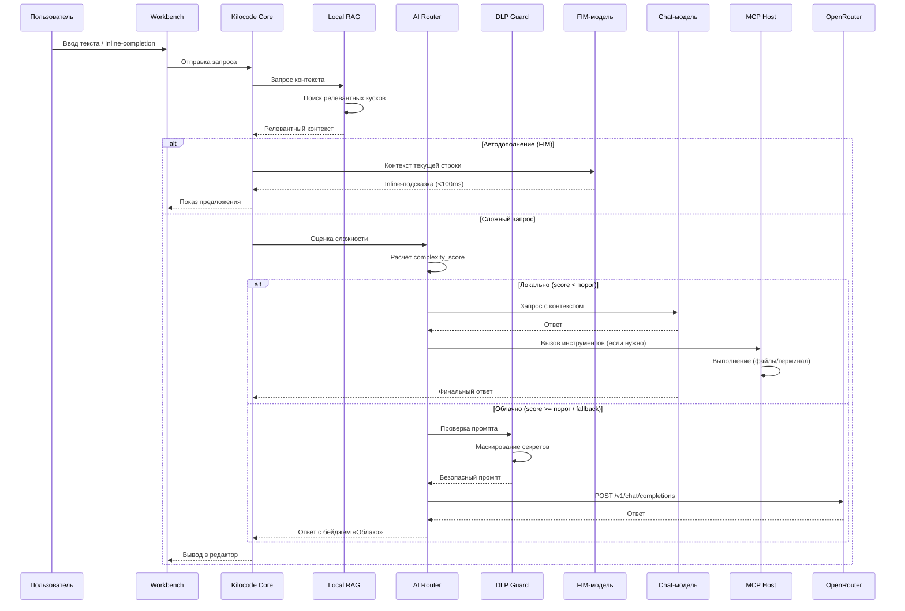
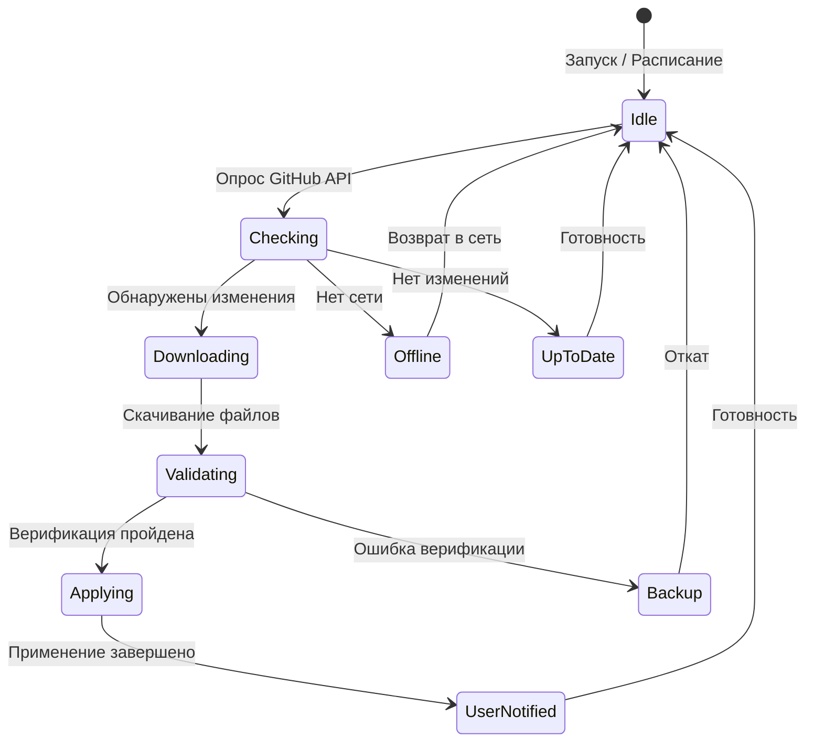

# Дополнения к ТЗ «Эвокод» (ТЗ-ЭК-001)
## Детализация архитектуры, производительности, версионирования, тестирования, безопасности и design decisions

**Документ:** ТЗ-ЭК-001-ADD
**Версия:** 1.0
**Дата:** 2026-07-18
**Статус:** Проект

---

## 1. Детализация архитектуры

### 1.1. Диаграмма последовательности роутинга запросов



### 1.2. Диаграмма состояний Skill Sync Engine



### 1.3. Структура файловой системы приложения

```
~/.config/evocode/
├── config.json                 # Основные настройки
├── sync-sources.json           # Источники синхронизации
├── models/                     # Каталог GGUF-моделей
│   ├── qwen2.5-coder-1.5b-Q4_K_M.gguf
│   └── qwen2.5-coder-7b-Q4_K_M.gguf
├── skills/
│   ├── system/                 # Системные навыки (read-only)
│   │   ├── agentic-coordination/SKILL.md
│   │   └── ...
│   ├── user/                   # Пользовательские оверрайды
│   │   ├── agentic-coordination/SKILL.md
│   │   └── custom-skill/
│   └── .backup/
│       └── 2026-07-18/         # Бэкапы по датам
├── rag/                        # Индекс RAG
│   ├── embeddings.db           # SQLite с эмбеддингами
│   └── config.json
├── mcp/                        # Конфигурация MCP-серверов
│   └── servers.json
└── logs/
    ├── sync.log                # Лог синхронизации
    └── router.log              # Лог роутера
```

---

## 2. Требования к производительности

### 2.1. Критические метрики (SLO)

| Метрика | Целевое значение | Условия | Измерение |
|---------|------------------|---------|-----------|
| **FIM latency (p95)** | < 100 ms | Inline-подсказка, Q1.5B | Время от ввода символа до отображения |
| **Chat TTFB (p95)** | < 2000 ms | Локальный вывод, Q7B | Время до первого токена |
| **Chat throughput** | > 30 tok/s | Локальный вывод, Q7B | Генерация / секунда |
| **Индексация RAG** | < 5 мин | Проект до 50k файлов | Время от открытия до готовности |
| **Skill Sync** | < 30 с | Стандартный набор источников | Время от запуска до завершения |
| **Memory footprint** | < 4 ГБ | FIM + Chat модели | RSS процесса |
| **Cold start** | < 15 с | Полная загрузка приложения | От клика до готовности |

### 2.2. Пороги и ограничения

- **VRAM**: минимальные требования 4 ГБ (FIM + Chat в shared memory); рекомендуемые 8 ГБ+.
- **CPU**: 4 ядра минимум; 8+ для параллельной генерации эмбеддингов.
- **Диск**: 2 ГБ на фреймворк; 10 ГБ на модели (если обе Q4).
- **Контекст**: максимум 262 144 токенов (ограничение llama.cpp).

### 2.3. Тесты производительности

- **Юнит-тесты**: FIM latency (100 итераций), RAG lookup (1000 запросов).
- **Интеграционные**: полный цикл роутинга (локально → облако), синхронизация навыков.
- **Нагрузочные**: 10 одновременных запросов, стресс-тест FIM при интенсивном вводе.
- **Критерий**: все SLO выполняются ≥ 95% времени в течение 24-часового тестового прогона.

---

## 3. Процесс обновления и версионирования

### 3.1. Версионирование навыков

Каждый навык (SKILL.md) содержит метаданные:

```yaml
---
name: agentic-coordination
version: "1.2.0"
source: github.com/evocode/skills
sha: abc123def456
updated: 2026-07-18
breaking: false
dependencies:
  - name: frontend-engineering
    version: ">=1.0.0"
---
```

**Политика версионирования (SemVer):**
- **Major** ( breaking): удаление полей, изменение формата SKILL.md, несовместимость с предыдущей версией.
- **Minor** (feature): добавление новых полей, расширение функциональности.
- **Patch** (fix): исправления, улучшения формулировок, оптимизация.

### 3.2. Обработка breaking changes

1. **Предупреждение**: при обнаружении `breaking: true` Sync Engine показывает уведомление перед применением.
2. **Авто-откат**: если после обновления навык не проходит валидацию (не может быть загружен Kilocode Core), происходит автоматический откат к предыдущей версии.
3. **Ручное подтверждение**: для major-обновлений пользователь получает диалог «Обновить? (может потребовать корректировки зависимостей)».

### 3.3. Зависимости между навыками

- Каждый навык может декларировать зависимости от других навыков (версия >= X.Y.Z).
- При обновлении навыка Sync Engine проверяет, удовлетворяются ли зависимости.
- Если зависимость не удовлетворена, обновлённый навык откладывается до обновления зависимого.

### 3.4. Каналы обновлений

- **Stable**: стабильные релизы навыков, проверенные сообществом.
- **Beta**: предварительные версии, включающие новые фичи.
- **Canary**: ночные сборки, самые свежие, но возможны regressions.

---

## 4. Требования к тестированию и приёмке

### 4.1. Расширенные критерии приёмки

| Критерий | Метод проверки | Критерий успеха |
|----------|----------------|-----------------|
| **Функциональность** | Ручное тестирование сценариев | Все сценарии из раздела 7 выполняются |
| **Роутинг** | Тест с 50+ запросами (разной сложности) | Корректный выбор маршрута ≥ 95% |
| **Приватность** | Анализ логов на наличие секретов | 0 секретов в логах за 24 часа |
| **Производительность** | Автоматические тесты (SLO) | Все метрики в пределах лимитов |
| **Обновления** | Применение 10+ обновлений навыков | 0 потерянных данных, корректный rollback |
| **Совместимость** | Запуск на Win/Linux/macOS | Стабильная работа на всех платформах |
| **Безопасность** | Пентест (DLP, sandbox) | 0 критических уязвимостей |

### 4.2. Автоматизированное тестирование

- **CI/CD**: каждый PR проходит полный набор тестов (unit + integration + E2E).
- **Nightly build**: ночная сборка с запуском всех тестов и проверкой производительности.
- **Canary release**: обновление на группе из 10% пользователей с мониторингом метрик.

### 4.3. Метрики качества кода

- **Покрытие**: > 70% для критичных модулей, > 50% для остальных.
- **Сложность**: Cyclomatic complexity < 15 для функций.
- **Дублирование**: < 5% дублирующегося кода.
- **Тайм-ауты**: 0 таймаутов в CI за последние 10 сборок.

---

## 5. Безопасность и приватность

### 5.1. Архитектура безопасности

```
┌─────────────────────────────────────────┐
│            Эвокод (App)                 │
│  ┌───────────────────────────────────┐  │
│  │      Sandbox (изолированное окруж.)│  │
│  │  ┌─────────┐  ┌────────────────┐  │  │
│  │  │ Kilo-  │  │  Skill Engine  │  │  │
│  │  │ code   │  │  (навыки)      │  │  │
│  │  └─────────┘  └────────────────┘  │  │
│  └───────────────────────────────────┘  │
├─────────────────────────────────────────┤
│    Директория доступа (read-only)       │
│    /home/user/projects                  │
│    /home/user/.config/evocode           │
└─────────────────────────────────────────┘
```

### 5.2. Требования к защите данных

- **Шифрование в покое**: API-ключи, секреты в Keychain/Keychain шифруются.
- **Шифрование в движении**: все HTTP-запросы используют HTTPS с валидацией сертификатов.
- **DLP Guard**: маскирует API-ключи, пароли, JWT, пути БД перед отправкой в OpenRouter.
- **Sandbox**: навыки исполняются в ограниченном окружении, доступ к ФС — только разрешённые каталоги.

### 5.3. Аутентификация и авторизация

- **Локальные модели**: не требуют аутентификации.
- **OpenRouter**: API-ключ хранится в Keychain, не передаётся в конфигах.
- **GitHub Sync**: токен GitHub для API-запросов (опционально, для rate-limit).
- **MCP-серверы**: каждый сервер имеет свои права (файлы, терминал, сеть).

### 5.4. Логирование и аудит

- **Логи**: метаданные (длина, тег, источник), без полных тел промптов и секретов.
- **Аудит**: журнал всех операций (запуск, роутинг, обновления) с временными метками.
- **Мониторинг**: метрики производительности (tok/s, latency, memory) в реальном времени.

---

## 6. Дизайн-решения и trade-offs

### 6.1. Архитектурные решения

| Решение | Обоснование | Альтернативы |
|---------|-------------|--------------|
| **Встроенный llama.cpp** | Минимальные зависимости, быстрая загрузка, офлайн-работа | Внешний сервер (llama-server), облачный API |
| **Двухмодельный инференс** | FIM требует низкой задержки, Chat — качества | Одна модель с dynamic batching |
| **Local RAG (SQLite-vec)** | Лёгкость, отсутствие внешних зависимостей | Pinecone, Weaviate, Chroma (Docker) |
| **Skill Overrides** | Защита пользовательских изменений от автообновлений | Mono-catalog с conflict resolution |
| **DLP Guard** | Приватность без потери функциональности | Полная локализация, без облака |
| **MCP Host** | Стандартизация, совместимость с экосистемой | Кастомные инструменты, JSON-RPC |

### 6.2. Trade-offs

1. **Локальность vs. Качество**: локальная модель дешевле и приватнее, но может уступать облачным в сложных задачах. Решение: гибридный роутинг с fallback.
2. **Автообновления vs. Стабильность**: частые обновления держат систему актуальной, но могут вносить regressions. Решение: раздельные каналы (stable/beta/canary) и rollback.
3. **Фондовая индексация vs. Ресурсы**: RAG улучшает контекст, но требует CPU/памяти. Решение: фоновое индексирование с настраиваемыми масками.
4. **Двухмодельный инференс vs. Сложность**: две модели дают лучшую производительность, но увеличивают потребление памяти. Решение: shared memory, настраиваемые лимиты VRAM.

### 6.3. Будущие направления

- **Multi-agent orchestration**: координация нескольких субагентов (как в kilocode).
- **Plugin-экосистема**: поддержка кастомных расширений и плагинов.
- **Collaborative features**: совместная работа, обмен навыками.
- **Edge deployment**: развёртывание на edge-устройствах (Raspberry Pi, NVIDIA Jetson).

---

## 7. Итоговая структура ТЗ

```
ТЗ-ЭК-001.md          — Основное техническое задание
ТЗ-ЭК-001-ADD.md      — Дополнения (этот файл)
  ├── 1. Детализация архитектуры
  ├── 2. Требования к производительности
  ├── 3. Процесс обновления и версионирования
  ├── 4. Требования к тестированию и приёмке
  ├── 5. Безопасность и приватность
  ├── 6. Дизайн-решения и trade-offs
  └── 7. Итоговая структура ТЗ
```

---

*Конец дополнений к ТЗ «Эвокод» (ТЗ-ЭК-001-ADD v1.0)*
