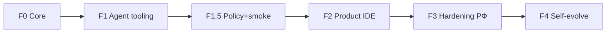

# 🗺️ Дорожная карта Эвокод

**Обновлено:** 2026-07-19 (критический пересмотр)  
**Продуктовый путь:** branded VSCodium + agent (Kilo runtime, native UX) + Evocode Core  

> **Source of truth для агентов:** [FULL_DEV_ROADMAP.md](./FULL_DEV_ROADMAP.md)

---

## Главный принцип

```
НЕ писать второй agent runtime  →  Kilo/OpenCode as-is (фичи, не бренд)
НЕ копировать GGUF              →  attach + profiles.json
НЕ Microsoft code               →  VSCodium / свой binary
Уникальность                    →  Core (DLP·router·skills) + native UX «Эвокод»
```

**Не цель:** совместимость с брендом Kilo / marketplace Kilo.

---

## Фазы (актуальная правда)



| Фаза | Статус | Суть (честно) |
|------|--------|----------------|
| **F0** | ✅ | Core HTTP, DLP, router, skills, RAG, OpenAI `/v1/*`, runtime API |
| **F1** | ✅ | Rebrand tooling, provider → Core :8083 |
| **F1.5** | ✅ | Policy bridge, SSE, embed :8084, smoke partial |
| **F2** | ✅ ~90% | Product surface + portable brand; splash/AppImage polish residual |
| **F3** | ⚡ **started** | Proxy, audit, auth token, sandbox flag — in progress |
| **F4** | 📋 later | LoRA / self-improve — после daily-use IDE |

### F2 — детализация (product DoD)

| ID | Задача | Статус |
|----|--------|--------|
| F2.1 | VSCodium clone | ✅ |
| F2.2 | product.evocode.json brand merge | ✅ |
| F2.3 | Preinstall agent + shell | ✅ |
| F2.3b | Runtime API + UI «Модели» | ✅ |
| F2.3c | Native chrome (no marketplace; toolbar) | ✅ |
| F2.3d | Единые настройки (product panel) | ✅ |
| F2.3e | Chat open by default | ✅ |
| F2.4 | First-run wizard (llama/skills) | ✅ |
| F2.5 | **Branded portable** (`ide:package-portable`) | ✅ + deb |
| F2.6 | Rename command IDs kilo→evocode | ✅ |
| F2.7 | Icons/splash fully Evocode | ✅ |
| F2.8 | SMOKE-IDE E2E | ✅ |
| F2.9 | Skills in tree | ✅ bulk present |

**DoD F2:** пользователь ставит/запускает **Эвокод** (не Code), видит чат + local model, **один** settings UI, без Kilo marketplace/лого.

---

## Очередь работ (P0)

1. **Единые настройки** — settings/profile → product panel; chat default on  
2. **Git baseline** — первый коммит  
3. **F2.5** — `ide:build-codium` → свой binary  
4. **Webview de-Kilo** — residual brand/marketplace inside React  
5. **First-run + smoke E2E**  

**Не делать сейчас:** F3 enterprise, F4 LoRA, второй MCP host.

---

## Команды

```bash
npm run build && npm test
npm run evocode              # VSCodium flatpak / codium only
npm run ide:install-desktop
npm run ide:build-codium     # long branded build
```

Порты: **8080** llama · **8083** Core · **8084** embed.
