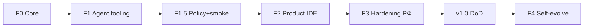

# 🗺️ Дорожная карта Эвокод

**Обновлено:** 2026-07-20  
**Продукт:** **v0.95.0 (Release Candidate 2)** — branded VSCodium + agent + Core + Skill Router + dual FIM  
**Продуктовый путь:** native UX «Эвокод» + privacy plane (Core)

> **Source of truth для агентов:** [FULL_DEV_ROADMAP.md](./FULL_DEV_ROADMAP.md)  
> **Срез:** [docs/STATUS.md](../docs/STATUS.md)

---

## Главный принцип

```
НЕ писать второй agent runtime  →  Kilo/OpenCode as-is (фичи, не бренд)
НЕ копировать GGUF              →  attach + profiles.json
НЕ Microsoft code               →  VSCodium / свой binary
Уникальность                    →  Core (DLP·router·skills) + native UX «Эвокод»
```

**Не цель:** совместимость с брендом Kilo / marketplace Kilo.

---

## Версии ↔ фазы

| Версия | Фазы | Смысл |
|--------|------|--------|
| 0.1.x | F0–F1 | Core + rebrand tooling |
| 0.2–0.4 | F1.5 + mid-F2 | Smoke, policy, early shell |
| 0.5.0 | F2 done | Product IDE, packaging, premium UI |
| **0.9.0** | **F3 done** | Trust, proxy, auth, SSRF, Operator Mode (RC1) |
| **0.95.0** | Skill Router + FIM | Router v2 M1–M4, dual-model autocomplete (RC2) |
| **1.0.0** | Pilot DoD | Daily-use + pilot corp |
| 1.x+ | F4 optional | LoRA / self-evolve |

---

## Фазы (актуальная правда)



| Фаза | Статус | Суть |
|------|--------|------|
| **F0** | ✅ | Core HTTP, DLP, router, skills, RAG, OpenAI `/v1/*`, runtime API |
| **F1** | ✅ | Rebrand tooling, provider → Core :8083 |
| **F1.5** | ✅ | Policy bridge, SSE, embed :8084, smoke |
| **F2** | ✅ | Product surface, Midnight Fusion UI, portable + deb + AppImage |
| **F3** | ✅ | Trust/security, proxy, audit, sandbox, РФ cloud, Operator Mode, polish |
| **F4** | 📋 later | LoRA / self-improve — после daily-use |

### F2 — закрыто (milestone → v0.5.0)

| ID | Задача | Статус |
|----|--------|--------|
| F2.1–F2.3e | VSCodium brand, preinstall, chrome, product panel | ✅ |
| F2.4 | First-run wizard | ✅ |
| F2.5 | Portable + deb + AppImage | ✅ |
| F2.6–F2.9 | Command rename path, icons, SMOKE-IDE, skills tree | ✅ |
| UI polish | Midnight Fusion, layout AI-IDE, icons, de-Kilo strings | ✅ |

**DoD F2 (достигнут):** пользователь запускает **Эвокод**, чат + local model, единый settings UI, без Kilo marketplace/лого как лица продукта.

### F3 — закрыто (milestone → v0.9.0)

| ID | Задача | Статус |
|----|--------|--------|
| F3.1 | HTTP/SOCKS5 proxy cloud | ✅ base |
| F3.2 | Audit log | ✅ base |
| F3.3 | bwrap sandbox flag | ✅ base |
| F3.5 | preferKiloIndexing | ✅ |
| F3.6–F3.7 | ACP + Astra docs | ✅ docs |
| F3.8 | Core auth non-localhost | ✅ base |
| F3.9 | MCP settings tab | ✅ |
| **F3.T1** | DLP block на OpenAI-path + unit tests | ✅ |
| **F3.T2** | Skill Sync: path traversal, SHA, SSRF | ✅ |
| **F3.T3** | Bind 127.0.0.1 default / rate limit | ✅ |
| F3.10 | Headless browse (optional) | 📋 |
| F3.U1 | Local fonts (no Google CDN) | ✅ |
| F3.U2 | DESIGN_SYSTEM = Midnight Fusion | ✅ |
| F3.U3 | Rebuild packages as 0.9.0 artifacts | ✅ |
| F3.U4 | Cold-start smoke (deb → first chat) | ✅ |

**DoD F3 / v0.9.0:** documented always-local + proxy + audit + закрытые trust-дыры для pilot corp, Operator visual mode.

---

## Очередь работ (P0) — v0.95.0 → 1.0.0

1. Пилоты: Operator preview + FIM autocomplete + skills route.
2. Пересборка/smoke deb+AppImage **0.95.0**.
3. Фидбек → стабильный **1.0.0**.
4. **Не делать сейчас:** F4 LoRA, второй MCP host, hard-fork microsoft/vscode

---

## Команды

```bash
npm run build && npm test
npm run evocode                 # product
npm run ide:package-portable
npm run ide:package-deb
npm run ide:package-appimage
```

Порты: **8080** llama · **8083** Core · **8084** embed.
