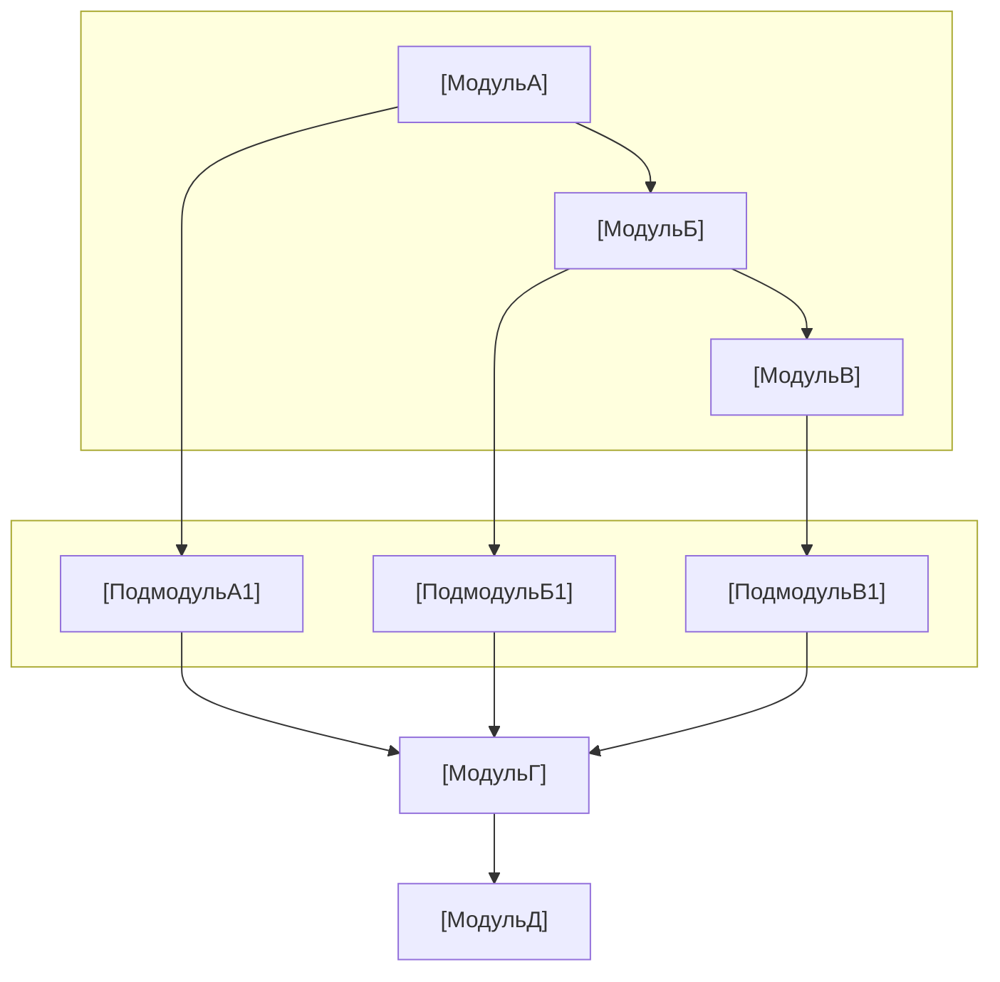

# Шаблон технической заявки на изобретение (обезличенный)

Этот документ — справочник формата и содержания технической заявки, обезличенный, подходит для заявок на изобретение в любой области. Цитируется из `disclosure_builder.md`.

---

## Шапка документа

```markdown
# Техническая заявка на изобретение

**Название изобретения**: [по запросу] Способ и система XXX

**Контактное лицо**:
- ФИО: [по запросу]
- Телефон: [по запросу]
- Email: [по запросу]

**Тип защиты**: Изобретение

---

## Примечания

(1) Заявка должна быть понятна патентному поверенному, особенно описание предшествующего уровня техники и подробное описание изобретения — необходимо писать полно, ясно, полностью;
(2) Степень раскрытия техники должна соответствовать уровню специалиста в данной области, способного осуществить изобретение без творческого труда;
(3) При обращении к поверенному по техническим вопросам — предоставлять ответы и пояснения, своевременно и корректно дополнять технические материалы.
```

При сохранении в каталоге пользователя **имя `.md`/`.docx`** — **`{нормализованное_название}_{YYYYMMDDHHmmss}`** (плейсхолдер убран, недопустимые символы удалены, обрезка длины, timestamp — см. `disclosure_builder.md` **§7.3**, **все доставки с timestamp**), избежать фиксированного имени, не связанного с заголовком.

---

## I. Предпосылки и предшествующий уровень техники

### 1.1 Предшествующий уровень техники

- Источники поиска, формат ссылок и запреты — по **`prior_art_search.md`** (не повторяется здесь).
- По **техническим направлениям** (например: одноклассовые методы, многоклассовые методы, стратегии кластеризации и т.д.)
- Каждая публикация должна включать: номер публикации / идентификатор, заявитель (или учреждение), техническая схема, область применения, **ограничения**, **ссылка на источник (обязательно)**
  - **ФИПС `abstract`**: если Step JSON содержит **`abstract`** — описание **должно быть на основе полного понимания abstract** (см. **`prior_art_search.md`**); не копировать абстракт дословно.
  - **Требование к URL**: с **`prior_art_search.md`** — каждая запись **как минимум одна** публичная ссылка, **проверена** перед записью; **запрещено** вымышленные ссылки.
  - **Рекомендация по тексту**: в каждой записи — строка **`Источник: …`** или таблица с колонкой «Ссылка».
- В конце — **резюме поиска** и **существенное отличие** данного решения от предшествующего уровня техники

### 1.2 Недостатки предшествующего уровня техники

- Пунктами, согласовано с ограничениями 1.1
- Выделить **ключевые недостатки**: проблемы, которые не решает предшествующий уровень

---

## II. Техническая задача, решаемая изобретением

- По пунктам — как ответ на недостатки раздела I
- Кратко, для铺垫 раздела III

---

## III. Подробное описание изобретения

### 3.1 Предпосылки

- Обобщённое описание области применения (обезличенное: КлассA/Б/В, область X и т.д.)
- Проблема, которую решает изобретение, и概述 ключевой инновации
- При наличии ручных этапов — предварительные условия (например: выборка должна обладать различимыми признаками)

### 3.2 Блок-схема системы

- Использовать **fenced mermaid** (рекомендуется `flowchart TB` / `LR` + `subgraph` для слоёв); названия модулей — обобщённые, без бизнес-терминов
- Перед доставкой — преобразовать в PNG через **`tools/mermaid_render.py`** и **по умолчанию** создать Word; **не** нужно ASCII-схемы (Word — только PNG)
- Иерархия должна быть явной; при сложности — разделить на несколько mermaid-диаграмм

**Шаблон mermaid блок-схемы** (заменить заголовок, модули, связи;围栏 такой же — `` ```mermaid``):



### 3.3 Описание функций модулей

**Важно**: **роль** каждого модуля и **взаимосвязи** между модулями — патент не фокусирует на входе/выходе.

- Роль: место модуля в общем решении
- Взаимосвязи: верхний/нижний уровни, потоки данных/управления, циклы

### 3.4 Описание процесса системы

#### Блок-схема

- Использовать **fenced mermaid**; **не** ASCII-схемы.
- Перед доставкой — преобразовать через **`tools/mermaid_render.py`** (локальный `mmdc`) в PNG и **по умолчанию** создать Word; при ошибке — `md_to_docx.py` вручную.

#### Пояснение процесса

- Текстом кратко описать шаги или соответствие узлам диаграммы (**не** заменять диаграмму текстом)
- Ключевые инновации — отдельный подраздел (например 3.4.1)

### 3.5 Ключевые параметры

- Уверенность/пороги: значение, диапазон
- Параметры алгоритма: формулы, ограничения
- Согласовано с формулами текста и числами примеров реализации

---

## IV. Преимущества изобретения по сравнению с предшествующим уровнем техники

- Сначала обобщённые тезисы, затем по пунктам
- Согласовано с задачами раздела II и объектами охраны раздела V
- Технические детали — по разделу III, раздел IV — тезисы

---

## V. Ключевые технические моменты и объекты охраны

- Ключевые инновации, каждая — краткое определение
- Ссылки на раздел III (например «детали — 3.4.1»)
- Избегать дублирования подробных технических описаний из раздела III

---

## VI. Прочее

### Примеры реализации

- Область применения (обезличенная)
- Классы, объём неразмеченных данных (обезличенный)
- Краткое описание процесса
- **Технический эффект**: количественный или качественный
- **Примеры параметров**: с пометкой «не ограничивают объём охраны»

---

## Чеклист обезличивания

| Проверяемый элемент | Способ обезличивания |
|---------------------|---------------------|
| Названия бизнеса/отрасли | Обобщить |
| Конкретные классы | КлассA, КлассB, КлассC и т.д. |
| Конкретные числа | «определённый объём», «предварительно заданное значение» и т.д. |
| Названия компаний/продуктов | Удалить или «некая система» |

---

## Запрещённые элементы (не включать в заявку)

- **Запрещено** в любом месте текста (особенно в **конце**) добавлять ссылки на репозиторий навыка, примеры, `patent-disclosure-skill`, `examples/`, «учебный/вымышленный пример», «не является юридическим обязательством» и другие **мета-сноски**; доставляемый документ — это **официальный текст технической заявки**, **завершается бизнес-разделами**.

## Проверка согласованности формул и параметров

- Формулы единообразны (например: веса уверенности, коэффициенты корректировки плотности)
- Диапазоны порогов согласованы (например 0.5–1.5, 0.8–1.2)
- Названия параметров согласованы (без смешивания синонимов)
- Числа примеров реализации согласованы с разделом 3.5
