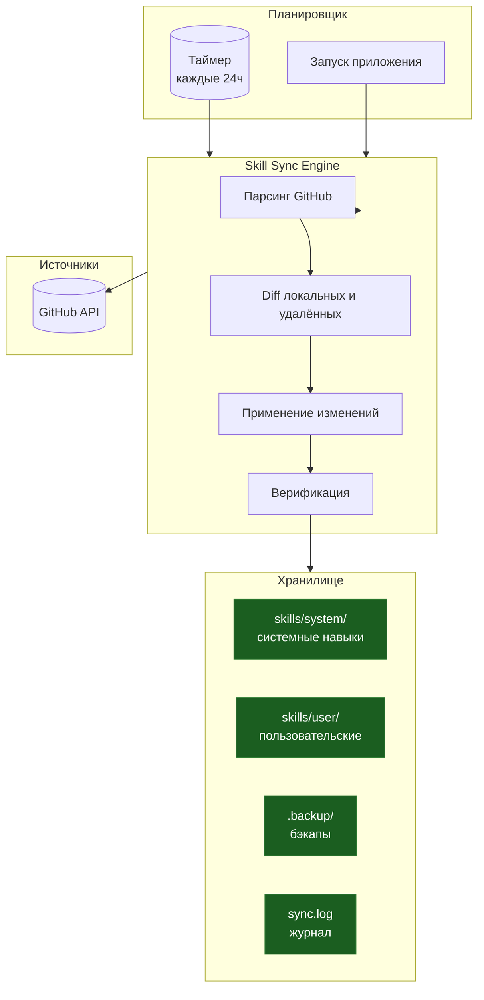

# Skill Sync Engine — ежедневная автоактуализация навыков

## Overview

Skill Sync Engine — компонент «Эвокод», который при каждом запуске и по расписанию (раз в сутки) синхронизирует навыки с внешними источниками (GitHub).

---

## Архитектура



---

## Источники синхронизации

### sync-sources.json

```json
{
  "sources": [
    {
      "name": "evocode-skills",
      "url": "https://github.com/evocode/skills",
      "path": "skills/",
      "branch": "main",
      "type": "github"
    },
    {
      "name": "kilocode-skills",
      "url": "https://github.com/kilocode/skills",
      "path": "skills/",
      "branch": "main",
      "type": "github"
    }
  ],
  "schedule": "0 3 * * *"
}
```

---

## Формат SKILL.md

### Обязательные поля

```yaml
---
name: skill-name
version: "1.0.0"
source: github.com/evocode/skills
sha: abc123def456
updated: 2026-07-18
breaking: false
---
```

### Опциональные поля

```yaml
dependencies:
  - name: other-skill
    version: ">=1.0.0"

triggers:
  - keyword1
  - keyword2

metadata:
  category: development
  author: evocode
```

---

## Логика синхронизации

### 1. Парсинг

- Получить дерево файлов из GitHub API
- Сравнивать content-hash с локальными файлами
- Классифицировать: `new`, `changed`, `removed`, `unchanged`

### 2. Diff

- Сравнить локальную версию с удалённой
- Определить изменения (новые, изменённые, удалённые навыки)
- Проверить зависимости

### 3. Применение

- Автоматически подтянуть `new` и `changed`
- Для `removed` — soft-delete (переместить в `.archive/`)
- Сохранить предыдущую версию в `.backup/<дата>/`

### 4. Верификация

- Проверить подписи/хеш источника
- Валидировать структуру SKILL.md
- Проверить зависимости

---

## Оверрайды (User Overrides)

### Разделение каталогов

- **Системная зона** (`skills/system/`) — обновляется Sync Engine
- **Пользовательская зона** (`skills/user/`) — не перезаписывается

### Логика загрузки

1. Загрузить системные навыки из `skills/system/`
2. Накинуть оверрайды из `skills/user/` (с приоритетом)
3. Если навык есть и в system, и в user — используется версия из user

### Пример

```
skills/
├── system/
│   ├── agentic-coordination/SKILL.md
│   └── frontend-engineering/SKILL.md
└── user/
    ├── agentic-coordination/          # Оверрайд
    │   └── SKILL.md                   # Переопределяет системный
    └── custom-skill/                  # Новый навык
        └── SKILL.md
```

---

## Логирование

### sync.log

```
2026-07-18 03:00:01 [INFO] Starting sync...
2026-07-18 03:00:02 [INFO] Checking source: evocode-skills
2026-07-18 03:00:05 [INFO] Found 2 new skills, 1 changed skill
2026-07-18 03:00:06 [INFO] Downloading new skills...
2026-07-18 03:00:08 [INFO] Applying changes...
2026-07-18 03:00:09 [INFO] Backup created: .backup/2026-07-18/
2026-07-18 03:00:10 [INFO] Sync completed: 3 skills updated
```

---

## Офлайн-поведение

### При недоступности сети

- Пропустить синхронизацию
- Записать в лог: `offline, skip`
- Использовать последнюю сохранённую версию навыков

### При недоступности GitHub

- Проверить кэш (если есть)
- Если кэш есть — использовать его
- Если кэша нет — записать в лог: `github unavailable, using cache`

---

## UI: Панель «Навыки»

### Элементы

- **Список навыков** с статусом (актуально, обновлён, новый)
- **Кнопка «Обновить сейчас»** — ручная синхронизация
- **Кнопка «Откатить»** — откат к предыдущей версии
- **Вкладка «Лог синхронизации»** — история изменений

### Статусы навыков

| Статус | Описание |
|--------|----------|
| ✅ Актуально | Навык не изменён с последнего обновления |
| 🔄 Обновлён | Навык обновлён при последней синхронизации |
| 🆕 Новый | Навык добавлен при последней синхронизации |
| 🗑️ Удалён | Навык удалён в источнике (soft-delete) |

---

## Интеграция с Kilocode Core

### Загрузка навыков

1. Skill Sync Engine обновляет `skills/system/`
2. Kilocode Core загружает навыки из `skills/system/` + `skills/user/`
3. При конфликте (один и тот же `name`) — приоритет у `skills/user/`

### Обработка breaking changes

- Если навык имеет `breaking: true` — показать предупреждение
- Если после обновления навык не работает — автоматический откат
- Если откат не помогает — запросить подтверждение у пользователя

---

## Критерии приёмки

- [ ] При запуске Skill Sync Engine опрашивает GitHub
- [ ] При наличии изменений — применяет их
- [ ] При отсутствии сети — пропускает синхронизацию
- [ ] При breaking changes — показывает предупреждение
- [ ] Доступен откат к предыдущей версии
- [ ] Логируются все операции синхронизации

---

*Конец спецификации Skill Sync Engine*
